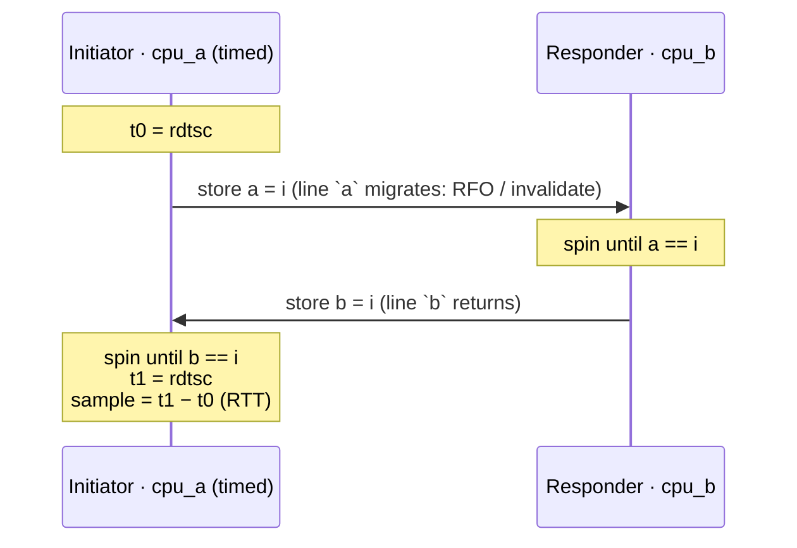
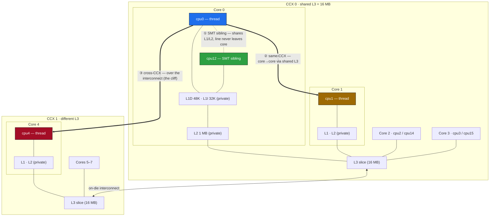
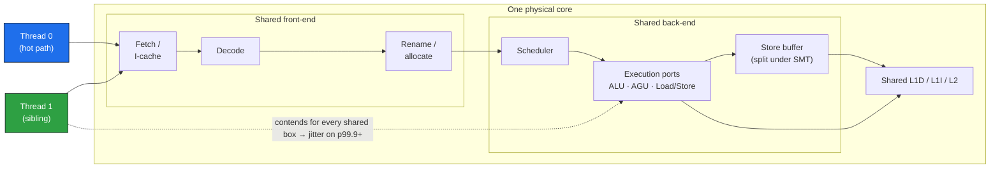
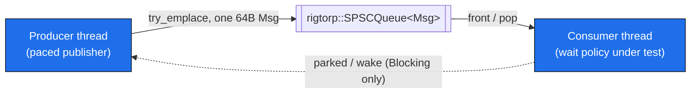

# smt_pingpong

A cache-line ping-pong microbenchmark: measures the round-trip latency of handing a cache line back and forth between two CPUs, and reports the full latency distribution across three topology distances — SMT sibling, same L3/CCX, and cross-CCX.

## What it measures

Two threads, each pinned to one logical CPU, hand a monotonically increasing sequence number back and forth through two shared flags (`a` and `b`, each on its own 128-byte-aligned region to rule out false sharing and adjacent-line prefetch effects):

```
INITIATOR (timed thread)                RESPONDER
------------------------------------    ---------------------------
t0 = rdtsc
store a = i   --- line `a` migrates -->  spin until a == i
                                         store b = i
spin until b == i  <-- line `b` back --
t1 = rdtsc
sample = t1 - t0   (one full round trip)
```

The same handoff as a sequence — one line each way, both threads hot-spinning:



Each store forces the other core to give up the line (a coherence invalidate / RFO), so exactly one line moves each way per iteration. Both threads are hot-spinning throughout — no thread-wakeup cost is included. This is the standard ping-pong metric: **best-case handoff latency between two live spinners**. The reported number is the full round trip (RTT); divide by 2 for an approximate one-way handoff latency.

Using a strictly increasing sequence number (rather than a toggling flag) means a stale cached value can never satisfy the wait — the spin exits only when it observes *this* iteration's value, ruling out ABA effects.

Timing is `rdtsc` fenced with `lfence` on both sides, converted to nanoseconds using a TSC frequency calibrated against `steady_clock` over a 300 ms busy-spin. Each pair runs 200k unrecorded warm-up round trips (coherence-state warming, branch training, clock ramp), then 2M recorded round trips — enough samples to populate p99.99.

### The three topology tiers (auto mode)

The benchmark reads Linux sysfs (`/sys/devices/system/cpu/*/topology`, `.../cache/index*`) to pick a representative partner for CPU 0 at each distance:

| Tier | Meaning | Where the line lives |
|---|---|---|
| **SMT sibling** | Two hardware threads on the *same physical core* | Shared L1/L2 — the line never leaves the core |
| **same L3 / CCX** | Two *distinct cores* sharing one L3 slice | Core→core, but inside one L3 domain |
| **cross CCX** | Cores in *different L3 domains* | Crosses the on-die interconnect — the expensive case |

Note on "same L2": on Zen, L1 and L2 are private per core, so the only logical CPUs that share an L2 are the SMT siblings of one core. There is no separate same-L2 tier — that *is* the SMT-sibling row.

This box's actual topology (single socket, 12 cores / 24 threads, 3 CCX; two CCX shown). The three coloured arrows are the three measured distances, all anchored on `cpu0`:



### The physical core under SMT

Why the sibling handoff is fastest *and* why a busy sibling is poison for the tail comes down to what two SMT threads share inside one core. The whole front-end and back-end are shared; some structures (store buffer, ROB entries) are **statically partitioned** the moment SMT is on, even if the sibling is idle:



- **Shared L1/L2** is why the SMT-sibling RTT is the lowest tier: the line stays inside the core.
- **Shared fetch/decode/ports** is why a *busy* sibling steals issue bandwidth from the hot thread — the fast median holds only if the sibling stays cooperative (or empty).
- `_mm_pause` on the hot spinner exists precisely to hand those shared ports back to the sibling; a bare spin there would starve it (hence the sibling pair runs the pause variant only).

### The two spin variants

- **pause** — the spin loop issues `_mm_pause` (x86 `PAUSE`). Realistic for a polite spinner, but on Zen 2+ PAUSE parks the core for ~64 cycles (~32 ns @ 2 GHz), so a peer store landing mid-PAUSE isn't seen until the PAUSE ends — it *adds* detection latency.
- **bare-spin** — the spin loop just re-loads in a tight loop. No PAUSE delay, so this is closer to raw coherence latency, at the cost of hammering the load unit and a branch mispredict on exit.

The (pause − bare-spin) gap isolates the PAUSE detection latency from the coherence cost itself.

The SMT-sibling pair only ever runs the **pause** variant: a bare spin on one sibling saturates the shared core's execution ports that the *other* sibling needs to perform its store, so it would measure self-inflicted starvation rather than handoff latency.

## Build

```sh
g++ -O3 -std=c++23 -pthread smt_pingpong.cpp -o smt_pingpong
g++ -O3 -std=c++23 -pthread sibling_noise.cpp -o sibling_noise
```

Both binaries share `pp_core.hpp`, but only its low-level primitives — `rdtsc_now`, `calibrate`, `pin`, `pct`, `Cfg`, `Slot`, and the sysfs topology helpers. `smt_pingpong` additionally uses the `bench<>` ping-pong loop; `sibling_noise` does not (its corrected design has no ping-pong). See "A second experiment: does a busy SMT sibling slow down a port-bound victim?" below.

or via CMake (defaults to a Release/-O3 build; `ctest` runs both binaries' `--test` self-checks):

```sh
cmake -B build && cmake --build build && ctest --test-dir build
```

x86-64 Linux only (rdtsc, `_mm_pause`, sysfs topology).

## Run

```sh
# Auto mode: discovers one pair per topology tier from /sys and runs all of them
./smt_pingpong

# Explicit pair mode: name two logical CPUs; runs BOTH spin variants on that pair
./smt_pingpong 0 12

# Self-check: pure-logic tests only (parse_list, pct) — no timing hardware needed
./smt_pingpong --test
```

Explicit mode validates both arguments (must be non-negative integers naming an online CPU) and exits non-zero immediately on bad input, rather than silently running a meaningless pair. If the two CPUs are SMT siblings, the bare-spin variant is skipped (one line explaining why) since a bare spin on a sibling is an invalid measurement — see "Why the sibling pair only runs pause" above. A pin failure inside either thread is fatal (`exit(1)`), not a logged warning: an unpinned pair means nothing, per the caveats below.

Auto mode prints the calibrated TSC frequency, then one line per pair with the distribution:

```
min / p50 / mean / p90 / p99 / p99.9 / p99.99 / max   (ns, round trip)
```

## Representative results

Measured on an AMD Zen box: single socket, 12 cores / 24 threads, invariant TSC ~1.996 GHz, private L1+L2 per core, L3 shared across a 4-core/8-thread CCX. **SMT on, but no core isolation, and boost/governor not locked** — so treat absolutes as noisy; the ordering is the robust result.

| Pair (variant) | min | p50 | p99 | p99.9 |
|---|---:|---:|---:|---:|
| SMT sibling (pause) | ~30 | ~50 | ~70 | ~70 |
| same L3/CCX (pause) | ~60 | ~90 | ~120 | ~210 |
| same L3/CCX (bare-spin) | ~70 | ~100 | ~110 | ~200 |
| cross CCX (pause) | ~190 | ~701 | ~982 | ~1723 |
| cross CCX (bare-spin) | ~230 | ~381 | ~972 | ~1733 |

All numbers are ns RTT. An earlier, quieter run of the same binary showed lower absolute numbers across the board — **only compare rows within a single run**, not across runs or machines.

### Interpretation

1. **The topology ordering holds at every percentile**: SMT sibling < same-CCX < cross-CCX. Crossing an L3/CCX boundary is the big cliff — roughly 4–7× the same-CCX median.
2. **PAUSE bias is real and worst at cross-CCX.** Under pause, the cross-CCX median is roughly *double* the bare-spin median (~701 vs ~381 ns p50): the return store keeps landing early in a ~64-cycle PAUSE window and the loop becomes phase-locked to it. At same-CCX the two variants are roughly a wash — the bare spin's tight-loop mispredict and load-unit pressure cancel out what dropping PAUSE saves.
3. **The huge p99.99/max outliers (microseconds to tens of microseconds) are OS jitter, not hardware.** Thread affinity only steers *this* benchmark's threads; it does not evict other work from those CPUs. Without isolation, the tail is the scheduler preempting a spin loop.

### Why atomics (and why they're free here)

A natural question: do the flag writes even need to be `std::atomic` — couldn't a plain `uint64_t` plus a barrier do? No, for two distinct reasons — and the atomics cost nothing anyway:

- **Hardware atomicity is not the issue.** On x86-64 an aligned 8-byte store is atomic at the hardware level regardless; the write was never going to tear.
- **The C++ data-race rule is the issue.** A plain `uint64_t` written by one thread and read by another is a data race → undefined behaviour, and `std::atomic_thread_fence` does not fix that — fences only synchronize *between atomic operations*. The UB is practical, not theoretical: in `while (b.v != i);` with a non-atomic `b.v`, the compiler sees no write in the loop, hoists the load, and emits an infinite loop at `-O2`. The atomic load is what forces a re-read each iteration. (`volatile` also forces the re-read but guarantees no cross-thread ordering — it "works on x86" by accident, not by contract.)
- **The atomics compile to nothing extra on x86.** `store(memory_order_release)` and `load(memory_order_acquire)` are both plain `mov` — x86's memory model already provides those orderings. No `lock` prefix, no `mfence` (verified in the emitted asm). Only `seq_cst` stores would cost (`xchg`/`mfence`), which is why the code uses acquire/release and not the default.
- `relaxed` + explicit `atomic_thread_fence` pairs would be the legal version of "just a barrier" — and compiles to the same binary on x86. Strictly more code for the same result. Acquire/release earns its keep on portability: on ARM it becomes `ldar`/`stlr` and the benchmark stays correct.

## A second experiment: does a busy SMT sibling slow down a port-bound victim?

`smt_pingpong` never actually measures the claim in "Why this matters for HFT" below — in its SMT-sibling row, the sibling *is* the cooperative ping-pong responder, not an independent noisy tenant. `sibling_noise.cpp` is a separate experiment built to isolate that variable.

**Revision note.** An earlier version of this experiment reused the same-CCX ping-pong as the victim and put a noisy tenant on the initiator's SMT sibling. A review proved that design structurally insensitive: the ping-pong's round trip is dominated by the cross-core coherence path (the line migrating to the responder core and back), so only a single-digit-nanosecond sliver of each sample actually executed on the contended core. A busy sibling could only ever perturb that sliver, and the predicted signal sat below the OS-jitter floor by construction — the prediction failed at every percentile, and it wasn't a tuning problem. The design below replaces it entirely; there is no ping-pong and no responder in this version.

**What it measures.** Only two logical CPUs matter: `cpu_hot` (the anchor) and its SMT sibling `cpu_sib`. 100% of the timed **victim** work runs on `cpu_hot` — a throughput-bound, high-ILP block: `N_LANES=8` independent accumulator lanes folding a small (4KB, L1-resident) buffer, with no cross-lane or cross-iteration dependency, so the lanes issue in parallel and press the core's issue ports. This is the key correction: a dependent/latency-bound workload (pointer chase, single accumulator) is exactly what SMT coexists with well, so it wouldn't show a signal either. A **tenant** thread pinned to `cpu_sib` runs one of three states, each its own pass:

- **idle** — no tenant thread at all.
- **noop** — tenant spins on `_mm_pause`, present but yielding the shared execution ports every iteration.
- **hot** — tenant runs the same independent-lanes shape as the victim (8 lanes over its own L1-resident buffer), genuinely competing for shared issue ports — not the earlier version's single dependent mul/add chain, which wasn't port-hungry enough to matter.

**Methodology.** Passes are interleaved round-robin across `R=8` repeats (idle, noop, hot, idle, noop, hot, ...) rather than run as three long sequential blocks, so thermal ramp and scheduler drift are spread evenly across all three states instead of biasing whichever one runs last on a drifting machine. Samples are pooled across all repeats per state for the percentile report; the min/median/max of the 8 *per-repeat* medians is reported separately as the run-to-run stability check — if that spread is small next to the gap between states, the ordering is a real effect, not noise.

**Prediction**: in the median, idle ≈ noop ≪ hot — a busy tenant steals issue ports (~1.3–2× slowdown expected); a polite pause tenant yields ports so it should look ≈ idle; mere tenant presence adds only minor static-partition overhead. The median is the robust signal here; tails remain OS-jitter-sensitive without core isolation, same caveat as `smt_pingpong` itself.

**Run it**:

```sh
./sibling_noise          # auto-selects cpu_hot / cpu_sib, runs the interleaved repeats
./sibling_noise --test   # pure-logic self-check, no timing hardware needed
```

Fails fast (non-zero exit) if `cpu_hot` has no SMT sibling (SMT off) — the experiment is meaningless without one.

**Limitation — "idle" is not "isolated".** "Idle" here means *no tenant thread is spawned by this tool*, not the sibling hardware thread offlined or otherwise quiesced at the OS/BIOS level. Actually emptying a CPU needs root (`isolcpus`/`cpuset`, or `echo 0 > /sys/devices/system/cpu/cpuN/online`), which is out of scope here — the kernel can still schedule unrelated work (other processes, IRQs) onto an "idle" sibling. Treat the idle row as a best-effort proxy, not a guarantee of a quiescent core.

**What we actually saw** (same laptop as above, SMT on, no core isolation, normal background load; `hot=cpu0`, `sibling=cpu12`; 40,000 samples per state pooled over 8 repeats):

| Tenant state | median | min | p90 | p99 | p99.9 | max | per-repeat median: min / median / max |
|---|---:|---:|---:|---:|---:|---:|---|
| idle (no tenant) | 370.7 | 360.7 | 370.7 | 380.7 | 510.9 | 6912.8 | 360.7 / 370.7 / 370.7 |
| noop (pause-spin) | 380.7 | 370.7 | 390.7 | 400.7 | 410.8 | 4087.6 | 380.7 / 380.7 / 380.7 |
| hot (busy tenant) | 671.2 | 370.7 | 691.3 | 711.3 | 731.4 | 25627.3 | 671.2 / 671.2 / 671.2 |

All ns per timed chunk.

Honest read: **the thesis held in the median.** idle (370.7 ns) and noop (380.7 ns) sit within ~3% of each other — a polite, port-yielding tenant is indistinguishable from no tenant at all — while hot (671.2 ns) is **1.81×** the idle median, squarely inside the 1.3–2× predicted range. The run-to-run per-repeat median spread within each state is only ~10 ns (idle: 360.7–370.7; noop and hot: perfectly flat across all 8 repeats), which is small next to the ~300 ns gap between {idle, noop} and hot — so this ordering is a real effect on this machine, not run-to-run noise. The tails (p99.9, max) are noisier and less trustworthy without core isolation, consistent with the caveat above; the median is where this design was built to show a signal, and it does.

## Methodology & caveats

- **rdtsc observer overhead**: the fenced `lfence; rdtsc; lfence` reads cost ~20–30 ns per sample pair. This is baked into *every* number, including bare-spin. Accepted as a known, constant tax.
- **TSC calibration**: the TSC is calibrated against `steady_clock` over a 300 ms busy-spin. This assumes an invariant TSC (constant tick rate regardless of core boost) — true on modern AMD/Intel; check `constant_tsc nonstop_tsc` in `/proc/cpuinfo` flags.
- **Absolutes are environment-sensitive.** For stable tails run with:
  - SMT enabled (otherwise no sibling pair exists to measure),
  - turbo/boost **off** and `governor=performance` (so the core clock doesn't drift mid-run and smear the distribution),
  - ideally `isolcpus` / `nohz_full` / IRQ affinity steering work off both CPUs of the pair. Without that, expect the p99.99/max tail to be dominated by scheduler noise.
- Pin failures are fatal (the process exits immediately): an unpinned thread can migrate mid-run, so the "pair" would mean nothing, and the run is defined as invalid rather than merely warned about.
- The sample array write (`(*samples)[i - 1] = ...`) happens between the two timed `rdtsc_now()` calls of the *next* iteration's window, not inside the one it records, but the store can still land late and overlap the very start of the next timed section on a busy store buffer. This is noise-level and accepted, not corrected for.

## What this does NOT measure

- **Throughput under load** — this is a latency benchmark of a strictly serialized handoff; it says nothing about bandwidth or sustained message rates.
- **Tail latency under contention** — both threads are dedicated, hot spinners with nothing else competing (by intent). Real systems with contended cores, cold wakeups (futex/condvar), or shared-line contention from third parties will look much worse.
- **Thread wakeup cost** — no futex/scheduler wakeup is in the path. This is the floor for two already-spinning threads, not the cost of waking a sleeping consumer.

## Why this matters for HFT (and why firms disable SMT)

This benchmark exists to answer: *does cross-core vs SMT-sibling placement matter for a latency-critical pipeline, and why do HFT shops turn SMT off if siblings are the fastest handoff?*

- **SMT siblings give the fastest raw handoff** — the line lives in the shared L1/L2 and never leaves the core (~50 ns RTT median here vs ~90 ns same-CCX, ~400–700 ns cross-CCX). If two pipeline stages genuinely hand off constantly, sibling placement is the raw-latency winner.
- **But a busy sibling contends for the physical core's shared resources.** Execution ports, L1/L2 capacity, and the store buffer are all shared between two SMT hardware threads. The fast sibling handoff above is measured with a *cooperative* sibling (the ping-pong responder); a genuinely busy, port-hungry tenant on that sibling is a different story. `sibling_noise.cpp` (below) measures this directly with a throughput-bound victim, and the effect shows up cleanly **in the median**: a busy tenant slowed the victim ~1.8× on this machine, while an absent or polite (pause-spinning) tenant was indistinguishable from no tenant at all. Read the experiment below before treating this as settled — it took a rewrite to get a workload actually sensitive to the effect, and the ping-pong RTT above is not that workload.
- **Affinity is necessary but not sufficient.** Pinning your hot thread steers *your* thread only — it does not keep the kernel, IRQs, or other processes off that CPU or its sibling. To effectively get "SMT off for this core" you must also keep everything else off *both* siblings (`isolcpus` / `nohz_full` / `irqaffinity`, or cpusets), and/or offline the sibling entirely: `echo 0 > /sys/devices/system/cpu/cpuN/online`.
- **The hybrid design real shops use**: a set of isolated, effectively-SMT-off cores for the hot path, and SMT-on cores for cold-path work (logging, risk batch jobs, housekeeping) where throughput matters and tails don't. Global BIOS SMT-off buys the last sliver of determinism — some microarchitectural resources are statically partitioned under SMT-on even when the sibling is idle — at the cost of throughput everywhere else on the box.

The cross-CCX cliff carries the same placement lesson one level up: keep tightly-coupled threads within one CCX/L3 domain, and treat any CCX (or socket) crossing as a deliberate, budgeted cost.

### "Why disable SMT at all if I can just pin?" — the best-of-both-worlds question

The obvious middle path: leave SMT **on**, pin the hot thread to one hardware thread of a core, and simply never schedule anything on its sibling. The rest of the box keeps SMT throughput; the hot core behaves like an SMT-off core. Is that valid?

**Mostly yes — but affinity is the wrong tool to build it with, and it isn't quite 100%.**

1. **Affinity constrains only the threads you pin.** `taskset`/`pthread_setaffinity_np` says "my thread runs here"; it says nothing about what *else* runs there. The kernel will happily place other processes, kernel threads, softirqs, and IRQ handlers on the sibling — and every one of them contends for the physical core's shared fetch/decode/ports/L1/L2 (see the pipeline diagram above). Pinning your thread while the sibling takes random tenants risks the median slowdown `sibling_noise.cpp` measures (~1.8× on a genuinely port-bound workload, above) whenever one of those random tenants happens to be port-hungry — see that experiment for the measurement backing (and honest caveats on) this claim.
2. **What actually empties the sibling** is one of:
   - boot-time isolation covering *both* logical CPUs of the core (`isolcpus=` + `nohz_full=` + `irqaffinity=`), or a `cpuset` shield;
   - offlining the sibling at runtime: `echo 0 > /sys/devices/system/cpu/cpuN/online` — a reversible, per-core SMT-disable that needs no reboot and removes all doubt.
3. **Even a perfectly idle sibling isn't identical to SMT-off in BIOS.** With SMT enabled, some core structures are statically partitioned or differently configured (store buffer, ROB entries, some queues — the details are µarch-specific; Zen recombines more gracefully than older Intel). An idle/offlined sibling recovers *nearly* all of it. "Nearly" is the gap BIOS SMT-off closes.

So the hybrid is real: **isolate + offline the sibling on your hot cores, keep SMT everywhere else.** You give up a sliver of determinism versus global SMT-off, and in exchange the rest of the machine keeps its throughput. Firms that run dedicated single-purpose boxes flip SMT off globally not because the hybrid doesn't work, but because on a machine with *no* cold path there's nothing to trade — global-off is simpler and closes the last gap for free.

## SPSC pipeline

`smt_pingpong` and `sibling_noise` both keep every CPU involved **fully busy** the whole time — neither has a notion of "core idle waiting for work." Real pipelines aren't always busy: when messages arrive slowly, spinning to catch the next one wastes an entire core (or, on an SMT sibling, half a physical core) for nothing. `spsc_pipeline.cpp` asks: at what arrival rate does it stop being worth it to spin, and how much latency do you pay to let the consumer sleep instead?

### The pipeline shape

One producer thread, one consumer thread, one [`rigtorp::SPSCQueue<Msg>`](https://github.com/rigtorp/SPSCQueue) between them (pinned to a specific commit — see `CMakeLists.txt` — so upstream can't silently change what this builds against):



Each `Msg` is exactly one 64B cache line (`seq`, `pub_tsc`, 6 payload words) so publishing one message can never generate coherence traffic on a neighbour's line. The consumer is anchored on `cpu0`; the producer runs on a partner selected by the same sysfs topology discovery `smt_pingpong` uses — SMT sibling, same-CCX, or cross-CCX. Unlike `smt_pingpong`, the roles are fixed and asymmetric: the consumer is the latency-critical side under measurement, the producer just needs to hit its pacing schedule.

Latency is end-to-end: `t_done` (consumer finishes processing) minus `pub_tsc` (stamped once, at the producer's *first* `try_emplace` attempt for that message — a backpressure retry never re-stamps it, so a message queued behind a full ring doesn't get to lie about when it was first offered).

### The three wait policies

| Policy | Consumer behaviour when the queue is empty | Cost model |
|---|---|---|
| **BareSpin** | Tight re-poll of `front()`, no `PAUSE` | Zero detection latency, burns 100% of the core, hammers the load unit |
| **Pause** | Re-poll with `_mm_pause` each iteration | Slightly higher detection latency (PAUSE's own park window), still burns 100% of the core, but yields shared execution ports to an SMT sibling |
| **Blocking** | Parks on a futex once the queue is observed empty; producer wakes it conditionally | Consumer core goes idle between messages, at the cost of a park/wake round trip added to that message's tail latency |

`WaitPolicy` is a template parameter, not a runtime enum tested per iteration — same reasoning as `pp_core.hpp`'s `relax<bool Pause>()`: the compiler specializes a dedicated wait loop per policy so the hot loop never spends a branch on which policy it's running.

**BareSpin is skipped on the SMT-sibling tier.** Producer and consumer there are two hardware threads of the *same physical core*; a bare spin on one thread saturates the shared core's execution ports the other thread needs to issue its own store/load, so the row would measure self-inflicted starvation, not handoff latency (identical reasoning to why `smt_pingpong`'s sibling pair only runs the pause variant). Blocking on the sibling tier is the marquee row instead: a parked consumer frees the *entire* logical CPU, easing port pressure on the physical core rather than adding to it.

### The futex conditional-wake protocol

Blocking's "sleep the consumer" mechanism is a hand-rolled eventcount on one 32-bit word (`ParkWord::v`) plus the raw `futex(2)` syscall — not `std::condition_variable`, because the point is to measure the actual kernel park/wake cost, not whatever a condvar's internal mutex adds on top.

The producer never syscalls unconditionally on every publish (that would defeat the point of the fast path): `maybe_wake()` does one relaxed load of `parked`, and only pays for `FUTEX_WAKE` on a hit. This is why `futex-wake-syscalls` should sit near 0 at `gap=0` (the queue is essentially never observed empty, so the fast path almost never fires) and climb toward the sample count as the gap widens (the consumer is parked before almost every message).

**The missed-wake hazard.** The producer must never publish a message, observe "nobody is parked," and skip the wake — while the consumer is mid-way through announcing that it's about to park. Without an ordering fix, this interleaving is possible even though each individual store is a normal atomic write:

```
consumer: front() sees empty -> parked.store(1) -> re-checks front(), STILL sees
          empty (producer's queue-index store hasn't drained from its store
          buffer yet) -> calls futex_wait
producer: try_emplace() succeeds (queue-index store enters store buffer)
          -> parked.load() executes EARLY, before that store drains, and
          observes parked==0 -> skips the wake
```

Result: the message is fully published, the consumer is genuinely parked, and nobody wakes it — masked only by the deadlock-insurance backstop timeout (`FUTEX_BACKSTOP_TIMEOUT_MS`), not by correctness.

**The fix is a textbook Dekker/StoreLoad fence pair — two `std::atomic_thread_fence(seq_cst)` calls, one on each thread, each sitting between that thread's own store and its own subsequent load:**

```
producer: queue-index store (try_emplace)
          atomic_thread_fence(seq_cst)     <- drains the store before the load
          parked.load(relaxed)
consumer: parked.store(1, relaxed)
          atomic_thread_fence(seq_cst)     <- drains the store before the load
          front() re-check (a load of the queue index)
```

Two seq_cst fences on different threads are totally ordered against each other — that ordering is exactly what `memory_order_seq_cst` guarantees for fences, independent of what memory order the *stores themselves* use. Whichever fence lands second in that total order is guaranteed to see everything the other thread wrote before its own fence, so at least one side of the race above always sees the other's write. This is a standard guarantee, not an x86 store-buffer accident.

It would be tempting to use a `seq_cst` *store* on the consumer's side instead of a relaxed store + fence (fewer lines, and it's what an earlier version of this code did) — but a seq_cst store paired against a seq_cst-fenced load on another thread is **not** formally guaranteed to give StoreLoad ordering by the C++ standard. That pairing happened to work on x86 only because GCC compiles a seq_cst store to `xchg`, which is itself a full barrier — a compiler-codegen accident, not a standard guarantee, and not something to depend on. The two-fence version above is formally watertight and, on x86, compiles to the *same* barrier either way — so fixing this cost nothing measurable.

**On the test coverage for this fence.** `--blocking-probe`'s MISSED-WAKE STRESS test exercises the park/wake protocol under randomized producer-side jitter (`nanosleep`-based delays straddling the announce/re-check/park window) and checks for zero backstop fires across 10k rounds. This is honest **protocol smoke coverage** — it round-trips the park/wake path, the EAGAIN path, spurious wakes, and sequence integrity under stress — but it is **not a regression test for the fence itself**. The race window the fence closes is a few nanoseconds wide (the store-buffer drain window), and `nanosleep` is itself a barrier with microsecond-scale granularity — several orders of magnitude too coarse to reliably land a jitter delay inside a few-ns window. When this fence was deliberately removed during review to check whether the probe would catch it, the stress test still passed 3/3 with zero backstop fires. The fence's correctness rests on the analytic Dekker argument above, not on any test result; the probe is there to catch protocol regressions (a broken re-check, a wrong clear-before-wake ordering, an EAGAIN path that actually sleeps), which are much larger-scale bugs it *can* reliably catch.

### Producer pacing

The producer runs an absolute-deadline schedule: message `n`'s target publish time is `t_start + n * gap_cycles`, computed fresh from `t_start` every iteration rather than accumulated by adding `gap_cycles` to the previous message's actual publish time. This means a late message never drags every subsequent message's deadline later with it — a producer that falls behind catches back up to the original schedule rather than free-running at a slower effective rate.

`pace_until(deadline)` is a two-phase busy-wait (never a real sleep — a sleep's wakeup granularity would swamp the sub-microsecond gaps this sweep cares about):

1. **Pause-coarse**: while more than `PACE_TAIL_CYCLES` from the deadline, spin with `_mm_pause` — core-friendly, doesn't hammer the load unit or starve a sibling for no reason.
2. **Bare-tail**: once within `PACE_TAIL_CYCLES` of the deadline, drop to a bare re-check spin — trades core-friendliness for the tightest possible deadline detection right at the end, since a PAUSE's own latency risks overshooting a deadline that close.

`pace_until` returns whether the deadline had *already* passed on entry (`late_on_entry`), which is the honest "late-publish" signal — comparing a *post-pacing* timestamp to the deadline would be trivially always-true, since the function only returns once `now >= deadline`. At `gap=0` the deadline is fixed at `t_start` for every message, so every message is legitimately "late" (saturated: no pacing possible) — that's the expected, correct reading of `late-publish ≈ SAMPLE_MSGS` at that row, not a bug.

### The arrival-rate sweep and what the metrics mean

`PipeCfg::GAP_NS` sweeps `{0, 250, 1000, 5000, 20000}` ns of producer inter-message gap, from saturated (back-to-back) to clearly sub-saturated. Per `(tier, policy, gap)` cell:

- **waited-fraction** — the share of sampled messages whose *first* `front()` poll found the queue empty. Near 0 at `gap=0` (the queue is rarely empty), approaching 1 as the gap widens past what the consumer can keep the queue topped up against.
- **parked-fraction** — the share of the sampled window's wall time the consumer spent inside the wait function (Blocking only). Measured over the *sampled* window specifically (consumer-stamped TSC marks at the start of message `WARM_MSGS` and the end of the last message), not the pass's full wall time — the full-pass window also includes thread pin/spin-up and the `WARM_MSGS` warm-up run, which would inflate the denominator and cap a fully-parked pass around 0.83 instead of letting it approach 1.0.
- **futex-wake-syscalls** — real `FUTEX_WAKE` syscalls issued (diffed around the pass from a global counter). Near 0 at `gap=0` (queue rarely empty, so the conditional fast path rarely fires), rising toward the sample count as the gap grows.
- **futex-backstop-fires** — the deadlock-insurance timeout firing. Should be exactly 0 in every real pass; a nonzero count here is a missed-wake smoking gun, not a normal outcome.

### The crossover: latency vs. core utilization

At `gap=0` all three wait policies converge — nothing is ever idle long enough for Blocking's park path to matter, and its wake-syscall count is near 0. **Read this row's latency number as queue-depth sojourn time (Little's law: mean latency ≈ mean queue depth / arrival rate), not as a measurement of wake cost** — the queue is saturated, so a message's latency is dominated by how many messages are ahead of it, not by how it was woken.

As the gap widens, BareSpin and Pause keep burning 100% of their core for a shrinking trickle of messages, while Blocking's consumer core goes idle between messages — parked-fraction climbs toward 1.0 — at the cost of the futex park/wake round trip added to each message's tail latency. Roughly: **spin/pause win on raw latency and burn a whole core doing it; Blocking frees on the order of 80%+ of that core back to the OS once the arrival rate is clearly sub-saturated, in exchange for a microsecond-scale wake tax per message.** Where exactly that crossover sits is workload- and machine-dependent — run the sweep and read the `parked-fraction` / latency columns together rather than trusting a single quoted number, since this box has no core isolation (see below).

### The measured mwaitx detour

An earlier phase of this project measured `mwaitx`/`monitorx` (the AMD hardware wait-on-address instructions, `WAITPKG`-adjacent) as a candidate for Blocking's park mechanism, on the theory that a hardware wait might beat a futex round trip for this sub-microsecond handoff. It didn't: on this Zen 5 box, `mwaitx` wake latency measured **~260ns p50**, against **~60ns for a plain spin** reacting to the same store — over 4× slower than just spinning — and imposed a **~350–480ns timeout floor** even in the best case. Both numbers rule it out for a handoff this latency-sensitive; a futex park/wake round trip, despite going through the kernel, is not meaningfully worse and is far simpler to reason about and to actually implement portably. `mwaitx`/`monitorx`/`CPUID`/`WAITPKG` accordingly do not appear anywhere in `spsc_pipeline.cpp` — this was evaluated and dropped, not overlooked.

### Future work

- **Spin-then-park hybrid.** Blocking here is a pure park-on-first-empty policy. Spinning briefly before falling back to a futex park (rather than parking on the very first empty poll) is very likely a better latency/utilization trade at the low end of the gap sweep — it would absorb short empty windows without paying the wake tax, while still freeing the core once the empty window looks sustained. Not implemented here, to keep this pass's three wait policies simple, orthogonal, and easy to reason about in isolation.
- **Bursty / intermittent arrival.** The gap sweep models a *steady* arrival rate at each row. Real feeds are often bursty — long quiet stretches punctuated by bursts — which stresses the park/wake path differently than a steady sub-saturated rate (every burst potentially pays a wake cost on its first message, then runs saturated until the burst drains). Not modelled here.

### No-core-isolation caveat

Same caveat as `smt_pingpong` and `sibling_noise`: this box runs with no `isolcpus`/`nohz_full`/IRQ affinity steering, so the OS scheduler and other work can land on either the producer's or consumer's CPU mid-run. Absolute latency numbers, especially in the tail (p99.9+), are environment-sensitive; compare rows *within one run* on this machine, not across runs or machines. `late-publish` and `waited-fraction` are the more robust cross-run signals since they're derived from the pacing schedule itself rather than raw tail latency.
