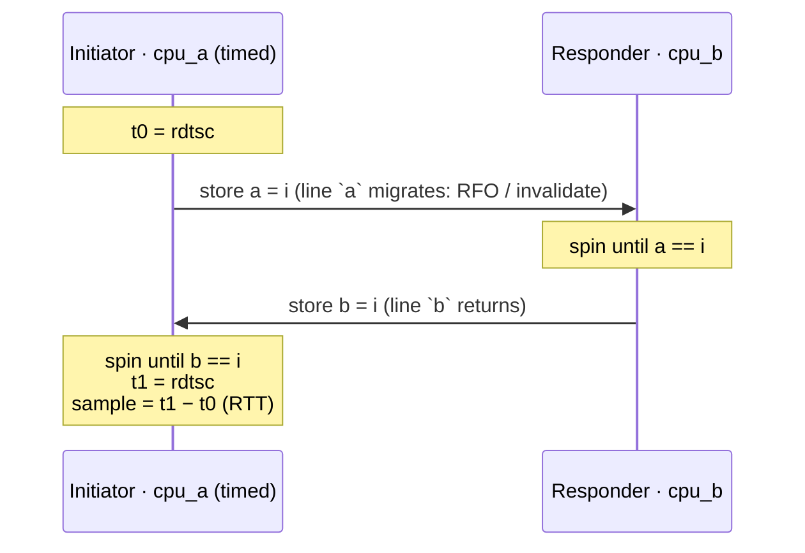
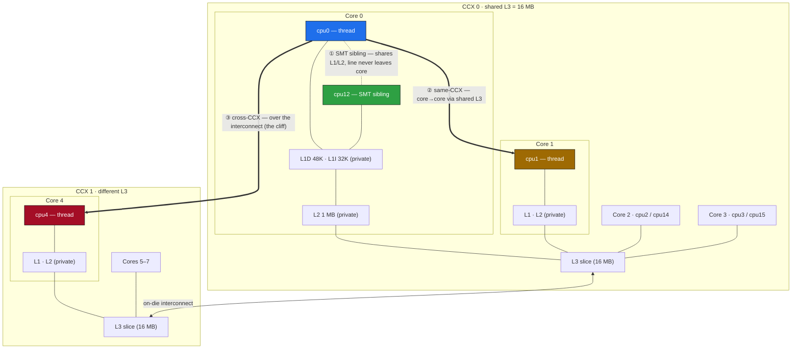
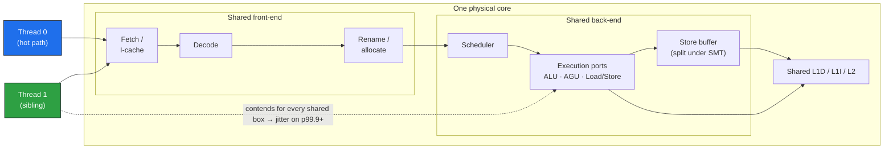

# smt_pingpong

A cache-line ping-pong microbenchmark: measures the round-trip latency of handing a cache line back and forth between two CPUs, and reports the full latency distribution across three topology distances — SMT sibling, same L3/CCX, and cross-CCX.

## What it measures

Two threads, each pinned to one logical CPU, hand a monotonically increasing sequence number back and forth through two shared flags (`a` and `b`, each on its own 128-byte-aligned region to rule out false sharing and adjacent-line prefetch effects):

```
INITIATOR (timed thread)                RESPONDER
------------------------------------    ---------------------------
t0 = rdtsc
store a = i   --- line `a` migrates -->  spin until a == i
                                         store b = i
spin until b == i  <-- line `b` back --
t1 = rdtsc
sample = t1 - t0   (one full round trip)
```

The same handoff as a sequence — one line each way, both threads hot-spinning:



Each store forces the other core to give up the line (a coherence invalidate / RFO), so exactly one line moves each way per iteration. Both threads are hot-spinning throughout — no thread-wakeup cost is included. This is the standard ping-pong metric: **best-case handoff latency between two live spinners**. The reported number is the full round trip (RTT); divide by 2 for an approximate one-way handoff latency.

Using a strictly increasing sequence number (rather than a toggling flag) means a stale cached value can never satisfy the wait — the spin exits only when it observes *this* iteration's value, ruling out ABA effects.

Timing is `rdtsc` fenced with `lfence` on both sides, converted to nanoseconds using a TSC frequency calibrated against `steady_clock` over a 300 ms busy-spin. Each pair runs 200k unrecorded warm-up round trips (coherence-state warming, branch training, clock ramp), then 2M recorded round trips — enough samples to populate p99.99.

### The three topology tiers (auto mode)

The benchmark reads Linux sysfs (`/sys/devices/system/cpu/*/topology`, `.../cache/index*`) to pick a representative partner for CPU 0 at each distance:

| Tier | Meaning | Where the line lives |
|---|---|---|
| **SMT sibling** | Two hardware threads on the *same physical core* | Shared L1/L2 — the line never leaves the core |
| **same L3 / CCX** | Two *distinct cores* sharing one L3 slice | Core→core, but inside one L3 domain |
| **cross CCX** | Cores in *different L3 domains* | Crosses the on-die interconnect — the expensive case |

Note on "same L2": on Zen, L1 and L2 are private per core, so the only logical CPUs that share an L2 are the SMT siblings of one core. There is no separate same-L2 tier — that *is* the SMT-sibling row.

This box's actual topology (single socket, 12 cores / 24 threads, 3 CCX; two CCX shown). The three coloured arrows are the three measured distances, all anchored on `cpu0`:



### The physical core under SMT

Why the sibling handoff is fastest *and* why a busy sibling is poison for the tail comes down to what two SMT threads share inside one core. The whole front-end and back-end are shared; some structures (store buffer, ROB entries) are **statically partitioned** the moment SMT is on, even if the sibling is idle:



- **Shared L1/L2** is why the SMT-sibling RTT is the lowest tier: the line stays inside the core.
- **Shared fetch/decode/ports** is why a *busy* sibling steals issue bandwidth from the hot thread — the fast median holds only if the sibling stays cooperative (or empty).
- `_mm_pause` on the hot spinner exists precisely to hand those shared ports back to the sibling; a bare spin there would starve it (hence the sibling pair runs the pause variant only).

### The two spin variants

- **pause** — the spin loop issues `_mm_pause` (x86 `PAUSE`). Realistic for a polite spinner, but on Zen 2+ PAUSE parks the core for ~64 cycles (~32 ns @ 2 GHz), so a peer store landing mid-PAUSE isn't seen until the PAUSE ends — it *adds* detection latency.
- **bare-spin** — the spin loop just re-loads in a tight loop. No PAUSE delay, so this is closer to raw coherence latency, at the cost of hammering the load unit and a branch mispredict on exit.

The (pause − bare-spin) gap isolates the PAUSE detection latency from the coherence cost itself.

The SMT-sibling pair only ever runs the **pause** variant: a bare spin on one sibling saturates the shared core's execution ports that the *other* sibling needs to perform its store, so it would measure self-inflicted starvation rather than handoff latency.

## Build

```sh
g++ -O2 -std=c++23 -pthread smt_pingpong.cpp -o smt_pingpong
```

x86-64 Linux only (rdtsc, `_mm_pause`, sysfs topology).

## Run

```sh
# Auto mode: discovers one pair per topology tier from /sys and runs all of them
./smt_pingpong

# Explicit pair mode: name two logical CPUs; runs BOTH spin variants on that pair
./smt_pingpong 0 12
```

Auto mode prints the calibrated TSC frequency, then one line per pair with the distribution:

```
min / p50 / mean / p90 / p99 / p99.9 / p99.99 / max   (ns, round trip)
```

## Representative results

Measured on an AMD Zen box: single socket, 12 cores / 24 threads, invariant TSC ~1.996 GHz, private L1+L2 per core, L3 shared across a 4-core/8-thread CCX. **SMT on, but no core isolation, and boost/governor not locked** — so treat absolutes as noisy; the ordering is the robust result.

| Pair (variant) | min | p50 | p99 | p99.9 |
|---|---:|---:|---:|---:|
| SMT sibling (pause) | ~30 | ~50 | ~70 | ~70 |
| same L3/CCX (pause) | ~60 | ~90 | ~120 | ~210 |
| same L3/CCX (bare-spin) | ~70 | ~100 | ~110 | ~200 |
| cross CCX (pause) | ~190 | ~701 | ~982 | ~1723 |
| cross CCX (bare-spin) | ~230 | ~381 | ~972 | ~1733 |

All numbers are ns RTT. An earlier, quieter run of the same binary showed lower absolute numbers across the board — **only compare rows within a single run**, not across runs or machines.

### Interpretation

1. **The topology ordering holds at every percentile**: SMT sibling < same-CCX < cross-CCX. Crossing an L3/CCX boundary is the big cliff — roughly 4–7× the same-CCX median.
2. **PAUSE bias is real and worst at cross-CCX.** Under pause, the cross-CCX median is roughly *double* the bare-spin median (~701 vs ~381 ns p50): the return store keeps landing early in a ~64-cycle PAUSE window and the loop becomes phase-locked to it. At same-CCX the two variants are roughly a wash — the bare spin's tight-loop mispredict and load-unit pressure cancel out what dropping PAUSE saves.
3. **The huge p99.99/max outliers (microseconds to tens of microseconds) are OS jitter, not hardware.** Thread affinity only steers *this* benchmark's threads; it does not evict other work from those CPUs. Without isolation, the tail is the scheduler preempting a spin loop.

### Why atomics (and why they're free here)

A natural question: do the flag writes even need to be `std::atomic` — couldn't a plain `uint64_t` plus a barrier do? No, for two distinct reasons — and the atomics cost nothing anyway:

- **Hardware atomicity is not the issue.** On x86-64 an aligned 8-byte store is atomic at the hardware level regardless; the write was never going to tear.
- **The C++ data-race rule is the issue.** A plain `uint64_t` written by one thread and read by another is a data race → undefined behaviour, and `std::atomic_thread_fence` does not fix that — fences only synchronize *between atomic operations*. The UB is practical, not theoretical: in `while (b.v != i);` with a non-atomic `b.v`, the compiler sees no write in the loop, hoists the load, and emits an infinite loop at `-O2`. The atomic load is what forces a re-read each iteration. (`volatile` also forces the re-read but guarantees no cross-thread ordering — it "works on x86" by accident, not by contract.)
- **The atomics compile to nothing extra on x86.** `store(memory_order_release)` and `load(memory_order_acquire)` are both plain `mov` — x86's memory model already provides those orderings. No `lock` prefix, no `mfence` (verified in the emitted asm). Only `seq_cst` stores would cost (`xchg`/`mfence`), which is why the code uses acquire/release and not the default.
- `relaxed` + explicit `atomic_thread_fence` pairs would be the legal version of "just a barrier" — and compiles to the same binary on x86. Strictly more code for the same result. Acquire/release earns its keep on portability: on ARM it becomes `ldar`/`stlr` and the benchmark stays correct.

## Methodology & caveats

- **rdtsc observer overhead**: the fenced `lfence; rdtsc; lfence` reads cost ~20–30 ns per sample pair. This is baked into *every* number, including bare-spin. Accepted as a known, constant tax.
- **TSC calibration**: the TSC is calibrated against `steady_clock` over a 300 ms busy-spin. This assumes an invariant TSC (constant tick rate regardless of core boost) — true on modern AMD/Intel; check `constant_tsc nonstop_tsc` in `/proc/cpuinfo` flags.
- **Absolutes are environment-sensitive.** For stable tails run with:
  - SMT enabled (otherwise no sibling pair exists to measure),
  - turbo/boost **off** and `governor=performance` (so the core clock doesn't drift mid-run and smear the distribution),
  - ideally `isolcpus` / `nohz_full` / IRQ affinity steering work off both CPUs of the pair. Without that, expect the p99.99/max tail to be dominated by scheduler noise.
- Pin failures are reported but non-fatal; TSC deltas remain valid, but the "pair" then means nothing — treat such runs as invalid.

## What this does NOT measure

- **Throughput under load** — this is a latency benchmark of a strictly serialized handoff; it says nothing about bandwidth or sustained message rates.
- **Tail latency under contention** — both threads are dedicated, hot spinners with nothing else competing (by intent). Real systems with contended cores, cold wakeups (futex/condvar), or shared-line contention from third parties will look much worse.
- **Thread wakeup cost** — no futex/scheduler wakeup is in the path. This is the floor for two already-spinning threads, not the cost of waking a sleeping consumer.

## Why this matters for HFT (and why firms disable SMT)

This benchmark exists to answer: *does cross-core vs SMT-sibling placement matter for a latency-critical pipeline, and why do HFT shops turn SMT off if siblings are the fastest handoff?*

- **SMT siblings give the fastest raw handoff** — the line lives in the shared L1/L2 and never leaves the core (~50 ns RTT median here vs ~90 ns same-CCX, ~400–700 ns cross-CCX). If two pipeline stages genuinely hand off constantly, sibling placement is the raw-latency winner.
- **But firms disable SMT for determinism, not median latency.** A *busy* sibling contends for the physical core's shared resources — execution ports, L1/L2 capacity, store buffer, TLB — and that contention lands squarely on p99.9+. The fast median is only real when the sibling is doing exactly the cooperative thing you placed there; any other tenant on it wrecks the tail.
- **Affinity is necessary but not sufficient.** Pinning your hot thread steers *your* thread only — it does not keep the kernel, IRQs, or other processes off that CPU or its sibling. To effectively get "SMT off for this core" you must also keep everything else off *both* siblings (`isolcpus` / `nohz_full` / `irqaffinity`, or cpusets), and/or offline the sibling entirely: `echo 0 > /sys/devices/system/cpu/cpuN/online`.
- **The hybrid design real shops use**: a set of isolated, effectively-SMT-off cores for the hot path, and SMT-on cores for cold-path work (logging, risk batch jobs, housekeeping) where throughput matters and tails don't. Global BIOS SMT-off buys the last sliver of determinism — some microarchitectural resources are statically partitioned under SMT-on even when the sibling is idle — at the cost of throughput everywhere else on the box.

The cross-CCX cliff carries the same placement lesson one level up: keep tightly-coupled threads within one CCX/L3 domain, and treat any CCX (or socket) crossing as a deliberate, budgeted cost.

### "Why disable SMT at all if I can just pin?" — the best-of-both-worlds question

The obvious middle path: leave SMT **on**, pin the hot thread to one hardware thread of a core, and simply never schedule anything on its sibling. The rest of the box keeps SMT throughput; the hot core behaves like an SMT-off core. Is that valid?

**Mostly yes — but affinity is the wrong tool to build it with, and it isn't quite 100%.**

1. **Affinity constrains only the threads you pin.** `taskset`/`pthread_setaffinity_np` says "my thread runs here"; it says nothing about what *else* runs there. The kernel will happily place other processes, kernel threads, softirqs, and IRQ handlers on the sibling — and every one of them contends for the physical core's shared fetch/decode/ports/L1/L2 (see the pipeline diagram above). Pinning your thread while the sibling takes random tenants gets you the fast median and the bad tail simultaneously — the worst trade.
2. **What actually empties the sibling** is one of:
   - boot-time isolation covering *both* logical CPUs of the core (`isolcpus=` + `nohz_full=` + `irqaffinity=`), or a `cpuset` shield;
   - offlining the sibling at runtime: `echo 0 > /sys/devices/system/cpu/cpuN/online` — a reversible, per-core SMT-disable that needs no reboot and removes all doubt.
3. **Even a perfectly idle sibling isn't identical to SMT-off in BIOS.** With SMT enabled, some core structures are statically partitioned or differently configured (store buffer, ROB entries, some queues — the details are µarch-specific; Zen recombines more gracefully than older Intel). An idle/offlined sibling recovers *nearly* all of it. "Nearly" is the gap BIOS SMT-off closes.

So the hybrid is real: **isolate + offline the sibling on your hot cores, keep SMT everywhere else.** You give up a sliver of determinism versus global SMT-off, and in exchange the rest of the machine keeps its throughput. Firms that run dedicated single-purpose boxes flip SMT off globally not because the hybrid doesn't work, but because on a machine with *no* cold path there's nothing to trade — global-off is simpler and closes the last gap for free.
