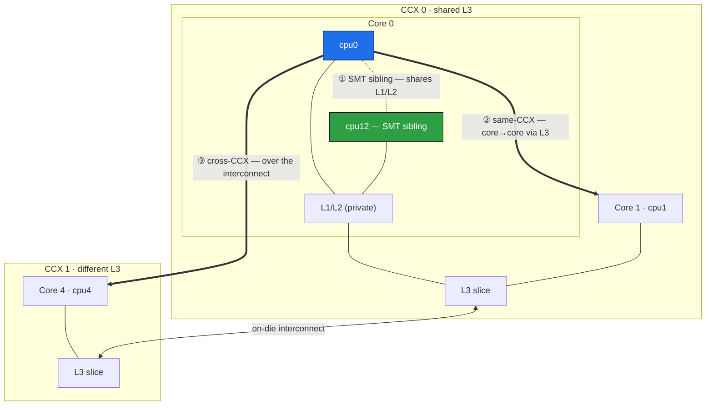
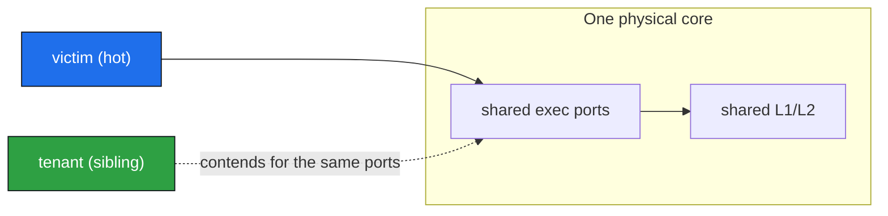

# SMT-IPC — where do you put two threads that talk to each other?

> *This is me being inquisitive over a weekend after an interesting discussion with an LLM, so
> please take this work with a grain of salt. None of it has been verified beyond me running it
> locally on my laptop with some toy experiments. It's also quite niche — what I've found is
> potentially a few small use cases where this might be worth investigating further. Having said
> that, it's quite interesting, so please enjoy...*
>
> **TL;DR — for two threads that pass messages to each other, the fastest place is the *same
> physical core* (its two SMT siblings), as long as the sibling stays *quiet* (no pun intended).** A sibling that's
> only cooperating — mostly `pause`-waiting for its partner — costs about **3%**, and in exchange
> you get the ~50 ns shared-L1/L2 handoff, **~2× faster** (≈1.8× measured) than putting the two
> threads on separate cores in the same CCX. That holds for my simulated per-message work (up to a
> couple of µs which may be more than enough for some cases),
> and — measured, and it surprised me — it holds whether *one or both* threads are
> busy, **as long as they're paced so they generally don't execute at the same instant** (a paced pipeline's
> consumer waits ~98% of the time, so the two just alternate). The one thing that kills it is
> genuine heavy **overlap** — the two threads grinding on the shared core at the same instant using same CPU ports (not TCP ports btw).
> That happens when an *independent* port-hungry tenant (hungry for the core's *execution* ports — the
> CPU's instruction-issue slots, not network ports; see Step 2) lands on the sibling (another
> process, an IRQ) —
> the full-time, worst case, is obvious... up to **~1.8×** slower compute (Step 2) — or when your own two threads
> run hot enough that pacing can no longer keep their work windows apart, a milder **~1.45×** at the
> partial duty a paced pipeline reaches (measured). Either way the sibling stops being worth it, and
> it bites at **overlap** — well before the queue ever *saturates*.
> Keeping the sibling *quiet* — only your cooperating, mostly-waiting partner on it — is the trick.
>
> What might be interesting to try is bursty workloads like we tend to see in capital markets...
> something for another rainy weekend maybe.
>
> **How to milk this in your design if you want it:**
> 0. **Keep SMT on** (in your BIOS / boot params) — obviously none of this exists without it.
> 1. **Pin your producer and consumer to the two SMT threads of one physical core** — that buys the shared-L1/L2 handoff.
> 2. **Keep everything else off that core.** Pinning steers *your* threads only; the kernel still lands IRQs and other work on the sibling. Isolate it (`isolcpus` + `nohz_full` + `irqaffinity`) or offline the neighbours — a quiet sibling *is* the trick.
> 3. **'Aim' for them to *not* execute at the same instant.** Under matched pacing the two threads alternate, so *both-busy is fine below the crossover* — the sibling still wins even when the producer works as hard as the consumer, because the pacer keeps their work windows *disjoint* (measured: the paced both-busy line lands right on polite). You lose it the moment they actually **overlap** — grind at the same instant because the load outpaces the gap — and that hits *well before* the queue saturates (in the overlap measurement the crossover collapses from ~2 µs to below ~0.5 µs, on rungs the tool confirms are queue-free). Pace the feed, or keep one side mostly waiting, so they never grind simultaneously.
> 4. **Stay under a few µs of work per message.** Past the crossover — or whenever the two must **overlap** (both grinding with no gap to interleave in) — step out to a *same-CCX* core instead (~40 ns slower handoff, but immune to on-core contention).
> 5. **Check before you commit:** I got my LLM to build `sibling_analyze` off some prior work I'd done in this space. The idea is it can statically analyse both sides of your SPSC setup with `llvm-mca` — no timing rig required.

If one thread hands messages to another — a socket consumer feeding a decoder, say — you get
to choose where the two run: same physical core (its two SMT threads)? Two cores sharing an
L3 slice? Further apart still? Folklore says "siblings are fastest, they share L1." That's
half right; this repo chases the other half: three small x86-64 Linux microbenchmarks on an
AMD Zen 5 box that build to one measured answer:

![Sibling vs same-CCX placement crossover: sibling−same-CCX latency as consumer work grows, for three producer regimes. Polite and paced-both-busy track each other and cross zero in a ~2–3.7 µs band (sibling wins below it). The overlapping-both-busy line crosses below ~0.5 µs and shoots off the top (+781 ns at 1.7 µs, then saturates). Two dashed lines are sibling_analyze's static estimates — purple for the polite/paced regime (its W* band is shaded) and red for the overlap regime. The shaded band around each measured line is the run-to-run spread (min–max over 9 runs), widest right at the crossovers.](docs/crossover.svg)

*Reading the three measured lines:* the x-axis is a ladder of per-message work from ~20 ns to
~7 µs; the y-axis is how much slower the SMT-sibling placement is than a same-CCX core (below zero
= sibling wins). All three lines feed the *same* consumer; they differ in the **producer**.
**Polite** (teal) just stamps and pushes — near-zero work. **Both busy, paced apart** (amber) does
the *same* work as the consumer, but the pacer keeps their work windows *disjoint* — it lands
right on top of polite. **Both busy, overlapping** (red) does that work with a gap sized for the
consumer alone, so the two genuinely *overlap* — it crosses below ~0.5 µs and rockets up. Step 4
has the full story.

The **shaded bands** are the honest part: each line's run-to-run spread (min–max over 9 runs on an
un-isolated box), fattest right where it crosses zero. At the crossover the delta straddles zero
*inside its own band* — which is why "where does the sibling stop winning?" only ever gets a fuzzy,
few-hundred-ns answer. (The line is the *mean* of the 9 runs; lopsided bands are real — the p50
delta is quantized to ~10 ns and often skewed, so most runs cluster near one edge with a stray run
forming the tail.)

**A processing consumer is faster on the producer's SMT sibling — but only up to a couple of
microseconds of work per message, and only if you keep everything else off that core. Past that, a
separate core in the same CCX wins.** Everything below is me poking at that one sentence, one
little experiment per angle.

## Step 1 — siblings really do give the fastest handoff

Start with the raw handoff, nothing else. `smt_pingpong` is the simplest possible thing: two
pinned threads bounce a cache line back and forth (a monotonically increasing sequence number
through two 128-byte-isolated flags, so a stale value can never satisfy the wait), both
hot-spinning, timed with fenced `rdtsc`. No wakeups, no work — just the best case, two live
spinners passing a line.

```
INITIATOR (timed)                RESPONDER
t0 = rdtsc
store a = i   --line a-->         spin until a == i
                                  store b = i
spin until b == i  <--line b--
t1 = rdtsc ; sample = t1 - t0
```

I run it across the three placements my chip's topology hands me:



The ordering came out unambiguous at every percentile: **SMT sibling ~50 ns, same-CCX ~90 ns,
cross-CCX ~700 ns** (median RTT, pause spinner). Crossing an L3/CCX boundary is a ~7–8× cliff —
so whatever else you decide, keep two tightly-coupled threads inside one CCX. If raw handoff
latency were the whole story you'd always pick the sibling — the line never leaves the shared
L1/L2. (Spoiler: it isn't, hence the other steps.)

*(Absolutes are noisy — no core isolation here, boost/governor unlocked, so the deep tail
p99.99/max is OS jitter, not hardware. The ordering is the robust part; compare rows only
within one run.)*

## Step 2 — but a busy sibling is poison

The catch: SMT threads don't just share cache, they share the physical core's **execution
ports** — the ALU / load-store issue slots where instructions actually dispatch ("port"
throughout this repo means these, never TCP ports) — plus the store buffer and front-end. The
ping-pong's sibling is a *cooperative* responder, so you never see the downside. I wrote
`sibling_noise` to isolate it: a genuinely port-hungry victim (8 independent multiply lanes,
L1-resident) on one thread, and a *tenant* on its sibling — idle, politely pausing, or busy
with the same port-hungry work.



| Tenant on the sibling | victim median | vs idle |
|---|---:|---:|
| idle | 370.7 ns | — |
| polite (`_mm_pause`) | 380.7 ns | +3% |
| busy (port-hungry) | 671.2 ns | **1.81×** |

A busy sibling nearly **doubles** the victim's work. So Step 1's fast handoff comes with a
hazard: anything port-hungry on your hot thread's sibling makes you pay. (A merely-*present*,
politely-pausing sibling costs almost nothing — hold that thought.)

## Step 3 — the hazard is strictly on-core

Is that 1.8× about "a busy neighbor somewhere on the chip," or specifically about sharing the
*core*? `sibling_noise --same-ccx` reruns the identical experiment with the tenant on a
*different* physical core in the same CCX — shared L3, but not ports, L1, or L2. The
port-bound victim is L1-resident, so it never even touches the L3:

| Tenant placement | idle | polite | busy |
|---|---:|---:|---:|
| SMT sibling (shares core) | 370.7 | 380.7 | **671.2** |
| same-CCX core (shares L3 only) | 370.7 | 370.7 | **370.7** |

A busy neighbor *core* costs the victim **nothing** — all three states are identical. The
1.8× is purely on-core port contention between SMT siblings. This is why "just pin your
thread" isn't enough: a hog on your *sibling* wrecks you, a hog on the *next core over* is
invisible.

## Step 4 — but a real partner is polite, so who actually wins?

So far the sibling looks like a trap — but Steps 2 and 3 loaded it with an *independent* hog,
which is the wrong picture. A real partner mostly *waits*, and a polite `pause`-waiter costs
only ~3% (Step 2's middle row), not 1.8×. So the real question isn't "is the sibling risky,"
it's **how much consumer work before contention on that work eats the sibling's ~40 ns handoff
edge?**

`spsc_pipeline --proc-sweep` measures it directly: a producer paces messages through a real
[SPSC queue](https://github.com/rigtorp/SPSCQueue) to a consumer doing a tunable, port-bound
amount of work per message, comparing **sibling vs same-CCX placement** end-to-end as that
work grows. Pacing is matched to each work level so the queue stays near-empty — the handoff
latency stays on the critical path, not hidden behind a backlog.

The result is the graph at the top. In numbers (Δ = sibling − same-CCX; negative = sibling
faster):

| consumer work / msg | sibling p50 | same-CCX p50 | Δ (ns) |
|---:|---:|---:|---:|
| 20 ns | 70 | 120 | **−50** |
| 120 ns | 180 | 220 | −40 |
| 451 ns | 511 | 561 | −50 |
| 1.7 µs | 1833 | 1853 | −20 |
| 6.9 µs | 7093 | 7033 | **+60** |

Sibling holds a steady ~50 ns lead while the work is light, the lead erodes past ~1.7 µs, and
same-CCX pulls ahead by ~7 µs — an interpolated **crossover around ~2–3 µs** (the exact point
wanders run-to-run; the stable part is the 1.7–6.9 µs bracket and the sign-flip). Because the
producer stays polite, the crossover lands in the *microseconds*, not the tens of nanoseconds
you'd guess from the 1.8× busy-sibling figure.

**Does that survive *both* threads being busy?** That turns entirely on one thing: **do they
run at the same instant?** Both `--both-busy` variants give the producer the *same* per-message
work as the consumer at every rung (at the 2 µs rung both spend ~2 µs, at the 500 ns rung
~500 ns). The only difference is the pacing gap, and that difference is the whole story.

**Paced apart (`--both-busy`, the amber line).** The arrival gap is widened to fit *both* threads'
work (the tool's `gap` column — roughly double the polite gap), keeping the two work windows
**disjoint**: the producer works while the consumer waits, never simultaneously
(`waited-fraction ≈ 0.99`, `proc_ratio ≈ 1.0`). The line lands right on top of polite — sibling
still wins below the ~2–3 µs crossover. Not luck, schedule: two busy threads whose compute never
overlaps don't contend, full stop. (Amber and teal *do* pull apart at the 6.9 µs rung — +170 ns vs
+50 ns — but not because the sibling suffers: its latency there matches the polite run to within
the ~10 ns measurement quantum. The gap is the *same-CCX* line running ~110 ns **faster** than its
own solo baseline while the neighbouring core grinds — a CPU-boost/residency quirk on the other
tier, not a sibling contention tax.)

**Overlapping (`--both-busy-overlap`, the red line).** Same symmetric work, but the gap is sized
for the consumer *alone*, so the producer's compute genuinely overlaps the consumer's. Now the two
grind on the same core's execution ports at the same instant — and the sibling falls apart: the
crossover collapses from ~2 µs to **below ~0.5 µs**, and the sibling runs **+781 ns slower** at
1.7 µs. That +781 is genuine on-core port contention, measured directly: the consumer's own compute
(`proc-insitu`, timed around just the kernel — no queue wait in the bracket) runs
`proc_ratio ≈ 1.45`, ~45 % slower than solo. Same mechanism as Step 2's busy-sibling tax, at
partial duty — the producer occupies the core only ~55–65 % of each gap — so milder than Step 2's
**1.8×**, the *full-time* independent-tenant cost. (The red line isn't even the worst case; a
continuously-busy neighbour is worse.) By the 6.9 µs rung the contention (~1.54×) exceeds the
sweep's 1.5× pacing headroom (`PROC_SWEEP_HEADROOM`), the queue can no longer be kept empty, and
end-to-end latency goes queue-drift dominated (tens to hundreds of µs, run-dependent) — the tool
flags that rung `INVALID` and it's dropped from the graph. The drop is *conservative*: with more
headroom the rung would be valid and show the sibling ~**+3.7 µs** worse, not recovering.

On the valid rungs the p50 latency is genuinely queue-free (`waited-fraction 0.92–0.99`), so the
loss is on-core contention, not queueing. So the honest rule has two halves:

- **Pace them apart** (bounded rate, or one side mostly waiting) and the sibling wins for work under
  ~2 µs whether one *or both* sides are busy — pacing turns a busy producer back into a polite one.
- **Let them overlap** (both grinding at a rate the gap can't separate) and the sibling loses *early
  and hard* — crossover below ~0.5 µs, then a cliff — well before the queue saturates. That's the
  regime Step 2's on-core contention (up to 1.8× for a full-time tenant) governs.

**Scope, so this isn't over-read:** the message source is an in-memory ring, *by design* — a real
socket's `recv()` is microseconds and would swamp this nanosecond-scale placement signal. This
answers "given a message in hand, does placement or processing weight decide who's faster," not
"is it fast enough for a live feed." And with no core isolation here, the crossover *direction*
reproduces **as long as the box is quiet and unthrottled** (check the `proc_insitu_ratio` column
reads ≈ 1 — on a loaded or low-power box the producer stops being polite and the sign can flip);
the exact point (~2–3 µs) is the softer part.

## Step 5 — predicting it for *your* threads, without running anything

Measuring the crossover (Steps 1–4) is a chore — a timing rig and a real-hardware sweep for every
workload. So here's the fun shortcut, honestly the part I was most curious about: can you just
*read* the answer off the compiled loops? `sibling_analyze` tries. Given your actual producer and
consumer loops, it guesses — from the instructions alone — whether they'll be faster as SMT
siblings or on separate cores. Basically a linter for thread placement. (This is the piece I had
my LLM build off some earlier work, so it's the most experimental part — grain of salt very much
applies.)

**You point it at your two hot loops.** Bracket each thread's steady-state loop with a matched
pair of markers from `sibling_marks.hpp`:

```cpp
#include "sibling_marks.hpp"
for (;;) {
  auto* m = q.front(); if (!m) { _mm_pause(); continue; }
  SIBLING_REGION_BEGIN("consumer");                 // opens the region
  for (int r = 0; r < rounds; r++) process(*m);     // the per-message work
  SIBLING_REGION_END("consumer");                   // closes it (matched by name)
  q.pop();
}
```

`SIBLING_REGION_BEGIN("consumer")` and `SIBLING_REGION_END("consumer")` are a pair — the name
string ties them together, so you can mark the producer's and consumer's loops distinctly in
one file. They expand to assembler-comment markers that tag *exactly which instructions* the
tool analyses. Three rules keep that honest, and the tool lints for all three: **wrap the whole
loop, not one iteration** (the model treats the marked span as a steady-state body repeated
forever); **keep the queue push/pop and any fences *outside* the region** (their cost is the
cross-core handoff, counted separately — including them would double-count it); and **no
un-inlined `call` inside** (its callee is invisible to the model, so the tool refuses rather
than analyse half the work).

**How it works, in a sentence:** the tool compiles your marked loops, feeds their instructions
to `llvm-mca` — a model of the CPU's execution ports — and asks *if these two loops ran at the
same time on one physical core, would they demand more of any execution port than the core can
supply?* If yes, it says split them; if no, the sibling's faster handoff wins, and it estimates
how much work-per-message you can afford before contention would outweigh the handoff savings.

**The output tells you what to do, in plain words** (the shipped `examples/spsc_marked.cpp`):

```
RESULT: these two loops will contend on the load/store unit (together they
        demand 1.15x what one core supplies) -> place them on SEPARATE cores.
```

When the loops *don't* oversubscribe a port, it flips to a budget — *"Placement budget ~1650 ns
of work per message; your consumer does ~100 ns/msg → the SMT sibling is faster."* The raw
numbers (which port, the contention multiplier, the budget and its range) print underneath as
`detail:` lines, and any lint warning rides next to the verdict. *(One knob:
`--consumer-iters-per-msg N` tells it how many loop iterations make one message, since
`llvm-mca` counts iterations, not messages; without it, it prints the budget but withholds the
recommendation rather than guess.)*

Two things to know before you trust it, both expanded in **[NOTES.md](NOTES.md)**: the `W*` budget
is mostly two *measured* constants (Δh/ε — only the port *verdict* is a genuine static prediction),
and llvm-mca sees compute, not memory, so a `COLLIDES` is trustworthy but a "no collision" only
clears the compute side — confirm memory-heavy loops with `sibling_noise`/`spsc_pipeline`. NOTES.md
also covers how the two dashed prediction lines on the graph are computed (the paced one and the
genuinely-out-of-sample overlap one) and where they stop being meaningful.

## Build & run

```sh
cmake -B build && cmake --build build && ctest --test-dir build   # builds all 4 + self-tests
```

```sh
./smt_pingpong            # handoff latency across the three placements
./smt_pingpong 0 12       # explicit CPU pair (validated; fatal on bad args / pin failure)
./sibling_noise           # busy-sibling contention (tenant on the SMT sibling)
./sibling_noise --same-ccx  # control: tenant on a same-CCX core instead
./spsc_pipeline           # the placement × processing-weight crossover (Step 4)
./spsc_pipeline --both-busy          # producer as busy as consumer, PACED apart (stays ~= polite)
./spsc_pipeline --both-busy-overlap  # producer as busy as consumer, OVERLAPPING (sibling loses below ~0.5us)
./sibling_analyze t.cpp --profile p   # STATIC: predict placement for marked threads (Step 5)
./sibling_analyze --calibrate 1.81    # derive calib_scale from a measured busy-sibling ratio
<tool> --test             # pure-logic self-checks, no timing hardware needed
```

The three runtime tools share `pp_core.hpp` (TSC calibration, pinning, percentiles, sysfs
topology discovery). Bad CPU args and pin failures are always fatal — an unpinned pair measures
nothing. **x86-64 Linux only** (`rdtsc`, `_mm_pause`, sysfs). `sibling_analyze` is separate and
dependency-light: its `--test` needs only a C++ compiler, and its analysis path additionally
needs `g++` and `llvm-mca` (report format validated against LLVM 18–20) on `PATH`; edit `example.profile`
into your own machine's numbers first.

## Caveats

- **No core isolation on my box (dev machine):** absolute tails (p99.9+) are OS-jitter-sensitive; compare
  within one run, not across runs or machines. Metrics derived from the pacing schedule
  (`waited-fraction`, `late-publish`) are the robust cross-run signals.
- **TSC** calibrated against `steady_clock`, assumes invariant TSC (`constant_tsc nonstop_tsc`).
- **Run the crossover at normal power, not low-power/throttled.** The result assumes the paced
  producer stays *polite* — check the `proc_insitu_ratio` column reads ≈ 1. Under a throttled
  clock the producer runs hot (ratio ≈ 2+) and same-CCX wins at every level — the crossover
  inverts. Not a fragile result, a wrong-conditions one.
- **Not measured:** throughput/bandwidth, third-party contention, and real-socket I/O (whose
  µs-scale syscalls would dominate every ns-scale result here).
- **`mwaitx` was evaluated and dropped:** the consumer waits with `_mm_pause`, not the AMD
  hardware wait-on-address — on this Zen 5 box `mwaitx` woke at ~260 ns p50 vs ~60 ns for a
  plain spin (>4× slower, ~350–480 ns timeout floor), so it isn't viable for a sub-µs handoff.

---

That's the whole rabbit hole. It's niche and I mostly just wanted to know where the sibling
stops winning — and, honestly, how well a static model could call it before I ran anything. If
you spot something wrong, I'd genuinely like to hear it.
