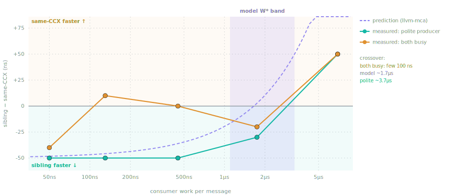
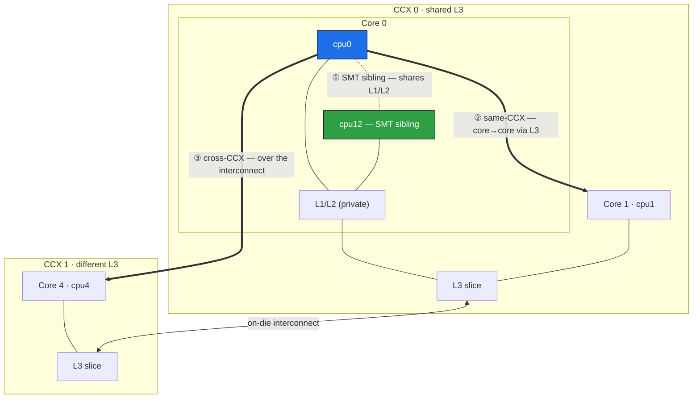
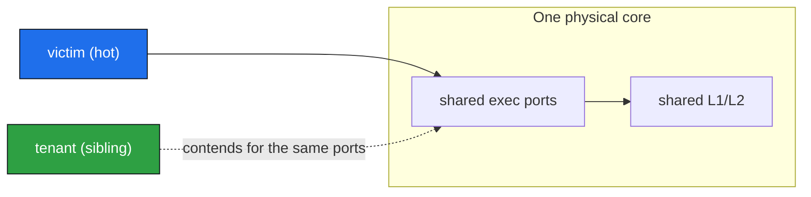

# SMT-IPC — where do you put two threads that talk to each other?

If one thread hands messages to another — a reader feeding a processor, a market-data
decoder feeding a strategy — you get to choose where those two threads run on a modern
many-core chip. Same physical core (the two SMT threads of one core)? Two cores sharing
an L3 slice? Further apart still? The folklore says "siblings are fastest, they share
L1." The folklore is half right, and chasing down the other half is what this repository
is. Three small x86-64 Linux microbenchmarks, run on an AMD Zen 5 box, that build to one
measured answer:



**A processing consumer is faster on the producer's SMT sibling — but only up to a couple
of microseconds of work per message. Past that, a separate core in the same CCX wins.** For
most real pipelines, which do well under a few µs of work per message, the sibling wins —
*if* you keep everything else off that core. Getting to that sentence takes four steps, each its
own experiment.

## Step 1 — siblings really do give the fastest handoff

`smt_pingpong` measures the raw thing: two pinned threads bounce a cache line back and
forth (a monotonically increasing sequence number through two 128-byte-isolated flags,
so a stale value can never satisfy the wait), both hot-spinning, and it times the round
trip with fenced `rdtsc`. No wakeups, no work — the best-case handoff between two live
spinners.

```
INITIATOR (timed)                RESPONDER
t0 = rdtsc
store a = i   --line a-->         spin until a == i
                                  store b = i
spin until b == i  <--line b--
t1 = rdtsc ; sample = t1 - t0
```

It runs that across three placements the machine's topology gives you:



The ordering is unambiguous, at every percentile: **SMT sibling ~50 ns, same-CCX ~90 ns,
cross-CCX ~700 ns** (median RTT, pause spinner). Crossing an L3/CCX boundary is a ~8× cliff.
So if raw handoff latency were the whole story, you'd always pick the sibling — the line
never leaves the shared L1/L2.

*(Absolutes are noisy — this box has no core isolation and boost/governor aren't locked,
so the deep tail p99.99/max is OS jitter, not hardware. The ordering is the robust part;
compare rows only within one run.)*

## Step 2 — but a busy sibling is poison

The catch: those two SMT threads don't just share cache, they share the physical core's
execution ports, store buffer, and front-end. In the ping-pong the sibling is a *cooperative*
responder, so you never see the downside. `sibling_noise` isolates it: it runs a genuinely
port-hungry victim (8 independent multiply lanes, L1-resident) on one thread and puts a
*tenant* on its sibling — idle, politely pausing, or busy with the same port-hungry work.



| Tenant on the sibling | victim median | vs idle |
|---|---:|---:|
| idle | 370.7 ns | — |
| polite (`_mm_pause`) | 380.7 ns | +3% |
| busy (port-hungry) | 671.2 ns | **1.81×** |

A busy sibling nearly **doubles** the victim's work. So the fast handoff from Step 1 comes
with a hazard: put anything port-hungry on your hot thread's sibling and you pay for it.
(A merely-*present*, politely-pausing sibling costs almost nothing — hold that thought, it's
the whole point later.)

## Step 3 — the hazard is strictly on-core

Is that 1.8× about "a busy neighbor somewhere on the chip," or specifically about sharing
the *core*? `sibling_noise --same-ccx` reruns the identical experiment with the tenant moved
to a *different* physical core in the same CCX — it shares the L3, but not the ports, L1, or
L2. The port-bound victim is L1-resident, so it never even touches the L3:

| Tenant placement | idle | polite | busy |
|---|---:|---:|---:|
| SMT sibling (shares core) | 370.7 | 380.7 | **671.2** |
| same-CCX core (shares L3 only) | 370.7 | 370.7 | **370.7** |

A busy neighbor *core* costs the victim **nothing** — all three states are identical. The
1.8× is purely on-core port contention between SMT siblings. This is exactly why "just pin
your thread" isn't enough: a hog on your *sibling* wrecks you, a hog on the *next core over*
is invisible.

## Step 4 — but a real partner is polite, so who actually wins?

Steps 2 and 3 make the sibling look dangerous — but they used an *independent* busy tenant.
In a real pipeline the partner isn't independent: the producer spends most of its time
*waiting* for the consumer, and a polite `pause`-waiter costs only ~3% (Step 2's middle row),
not 1.8×. So the worst case rarely fires. Which means the honest question isn't "is the
sibling risky" — it's **at what amount of consumer work does the sibling's ~40 ns handoff
edge get eaten by the contention on that work?**

`spsc_pipeline --proc-sweep` measures it directly: a producer paces messages through a real
[SPSC queue](https://github.com/rigtorp/SPSCQueue) to a consumer doing a tunable, port-bound
amount of work per message, and it compares **sibling vs same-CCX placement** end-to-end as
that work grows. Pacing is matched to each work level so the queue stays near-empty — the
handoff latency is on the critical path, not hidden behind a backlog.

The result is the graph at the top. In numbers (Δ = sibling − same-CCX; negative = sibling
faster):

| consumer work / msg | sibling p50 | same-CCX p50 | Δ (ns) |
|---:|---:|---:|---:|
| 20 ns | 70 | 120 | **−50** |
| 120 ns | 180 | 220 | −40 |
| 451 ns | 511 | 561 | −50 |
| 1.7 µs | 1833 | 1853 | −20 |
| 6.9 µs | 7093 | 7033 | **+60** |

Sibling holds a steady ~50 ns lead while the work is light, the lead erodes past ~1.7 µs,
and same-CCX pulls ahead by ~7 µs — an interpolated **crossover around ~2–3 µs** (the exact
point wanders run-to-run; the stable part is the 1.7–6.9 µs bracket and the sign-flip). Because
the producer stays polite, the crossover lands in the *microseconds*, not the tens of
nanoseconds you'd guess from the 1.8× busy-sibling figure. The practical reading: a consumer
doing less than a couple of µs of work per message — the common case — is faster on the SMT
sibling, provided the producer stays polite and nothing else runs on that core.

**But "polite" is doing real work in that sentence.** Make the producer busy too and both
threads become each other's victim — `--proc-sweep --producer-rounds 512` runs exactly that, and
the crossover *collapses from ~3.7 µs to the low hundreds of ns* (with `proc_ratio` measured at ~1.5, genuine
mutual contention, not the ~3 % polite tax). So the real rule is: siblings win only while one
side stays polite; once both are heavy, step to separate cores. Both regimes — polite and
both-busy — are the two solid lines in the graph at the top; the dashed line is Step 5's static
prediction of the same crossover, landing between them.

**Scope, so this isn't over-read:** the message source is an in-memory ring, *by design* — a
real socket's `recv()` is microseconds and would swamp this nanosecond-scale placement signal
entirely. This answers "given a message already in hand, does placement or processing weight
decide who's faster," not "is it fast enough for a live feed." And with no core isolation on
this box, the crossover *direction* reproduces run to run; the exact point (~2–3 µs) is the
softer part.

## So, for HFT

- **Siblings are the fastest handoff, and for realistic per-message work they win** — the
  producer waits politely, so the contention penalty stays small and the ~40 ns handoff edge
  carries you to a couple of µs of consumer work.
- **The catch is everything *else* on the core.** The win holds only if the sibling is your
  cooperating partner (or empty). Any independent port-hungry tenant — another process, an
  IRQ handler, a kernel thread — brings the 1.8×. Pinning steers *your* thread, not the
  kernel's; to truly own the core you need `isolcpus`+`nohz_full`+`irqaffinity` or offlining
  across **both** SMT threads, which is why HFT shops isolate hot cores or disable SMT outright.
- **Heavy per-message work (> ~3 µs) or an untrusted sibling → step out to a same-CCX core.**
  You give up ~40 ns of handoff for immunity to on-core contention.
- **Keep tightly-coupled threads inside one CCX regardless** — the cross-CCX cliff is ~8× and
  dwarfs any of this.

## Step 5 — predicting it for *your* threads, without running anything

Steps 1–4 *measure* the crossover — but measuring means building the timing rig and running a
sweep, on the target hardware, for every workload you're curious about. `sibling_analyze` asks
the same question **statically**: given your actual producer and consumer loops, can you tell —
from the compiled instructions, before running anything — whether they'll be faster as SMT
siblings or on separate cores? It's a linter for thread placement.

**You point it at your two hot loops.** Bracket each thread's steady-state loop with a matched
pair of markers from `sibling_marks.hpp`:

```cpp
#include "sibling_marks.hpp"
for (;;) {
  auto* m = q.front(); if (!m) { _mm_pause(); continue; }
  SIBLING_REGION_BEGIN("consumer");                 // opens the region
  for (int r = 0; r < rounds; r++) process(*m);     // the per-message work
  SIBLING_REGION_END("consumer");                   // closes it (matched by name)
  q.pop();
}
```

`SIBLING_REGION_BEGIN("consumer")` and `SIBLING_REGION_END("consumer")` are a pair — the name
string ties them together, so you can mark the producer's loop and the consumer's loop
distinctly in one file. They expand to assembler-comment markers that tag *exactly which
instructions* the tool analyses. Three rules keep that honest, and the tool lints for all three:
**wrap the whole loop, not one iteration** (the model treats the marked span as a steady-state
body repeated forever); **keep the queue push/pop and any fences *outside* the region** (their
cost is the cross-core handoff, already counted separately — including them here would
double-count it); and **no un-inlined `call` inside** (its callee is invisible to the model, so
the tool refuses rather than analyse half the work).

**How it works, in a sentence:** the tool compiles your marked loops, feeds their instructions
to `llvm-mca` — a model of the CPU's execution ports — and asks *if these two loops ran at the
same time on one physical core, would they demand more of any execution port than the core can
supply?* If yes, they'll fight, and it says split them; if no, the sibling's faster handoff
wins, and it estimates how much work-per-message you can afford before the fight would outweigh
the handoff savings.

**The output tells you what to do, in plain words** (the shipped `examples/spsc_marked.cpp`):

```
RESULT: these two loops will contend on the load/store unit (together they
        demand 1.15x what one core supplies) -> place them on SEPARATE cores.
```

When the loops *don't* oversubscribe a port, it flips to a budget instead — *"Placement budget
~1650 ns of work per message; your consumer does ~100 ns/msg → the SMT sibling is faster."* The
raw numbers (which port, the contention multiplier, the budget and its range) print underneath
as `detail:` lines, and any lint warning rides right next to the verdict. *(One knob:
`--consumer-iters-per-msg N` tells it how many loop iterations make one message, since
`llvm-mca` counts iterations, not messages; without it, it prints the budget but withholds the
recommendation rather than guess.)*

**It takes the "both threads are victims of each other" view — which is the point.** The tool
*sums* both loops' demand on each port, so it models mutual contention, not one thread
victimising a passive one. That's why its estimate lands *between* the two regimes we measured:
with a **polite** producer the crossover measured ~3.7 µs (the producer barely competes, so the
sibling wins far out), and with **both threads busy** it collapsed into the low hundreds of ns (each taxes the
other — `spsc_pipeline --proc-sweep --producer-rounds 512` measures exactly that mutual case).
The static ~1.7 µs estimate is the safe, both-competing default.

**How accurate is it?** On this box, for that example, it predicts a budget of **~1.65 µs**; the
measured crossover runs **~2.4–3.7 µs** (polite) down to **the low hundreds of ns** (both busy). So it's right
on *direction* and *order of magnitude*, and within ~2× of the polite measurement — good for a
compile-time screen that runs nothing. Its port model is validated separately: `--calibrate`
maps the predicted contention onto the *measured* 1.81× busy-sibling ratio from Step 2, and
lands within 0.7%. The overlay at the top of this README is `sibling_analyze --emit-model` (the
dashed prediction) plotted against both measured curves; `scripts/plot_crossover.py --check`
asserts they agree by numbers, not pixels — on **same-machine** data only, since the model is
micro-architecture-specific, so regenerate `docs/crossover_data.csv` from
`spsc_pipeline --proc-sweep` on your own box before a pass elsewhere means anything.

**It's a screening linter, not an oracle — and the limits are load-bearing.** `llvm-mca` sees
execution ports and front-end dispatch and *nothing else*: it assumes perfect caches and store
buffers and a single instruction stream. So a `COLLIDES` verdict (the ports genuinely
oversubscribe) is trustworthy, while a "no collision" only clears the *compute* side — for
anything memory-heavy, confirm with `sibling_noise`/`spsc_pipeline`, which stay the ground
truth. The tool also diffs your code compiled with and without the markers, to catch a marker
that accidentally changed what ships (e.g. blocked vectorisation).

## Build & run

```sh
cmake -B build && cmake --build build && ctest --test-dir build   # builds all 4 + self-tests
```

```sh
./smt_pingpong            # handoff latency across the three placements
./smt_pingpong 0 12       # explicit CPU pair (validated; fatal on bad args / pin failure)
./sibling_noise           # busy-sibling contention (tenant on the SMT sibling)
./sibling_noise --same-ccx  # control: tenant on a same-CCX core instead
./spsc_pipeline           # the placement × processing-weight crossover (Step 4)
./sibling_analyze t.cpp --profile p   # STATIC: predict placement for marked threads (Step 5)
./sibling_analyze --calibrate 1.81    # derive calib_scale from a measured busy-sibling ratio
<tool> --test             # pure-logic self-checks, no timing hardware needed
```

The three runtime tools share `pp_core.hpp` (TSC calibration, pinning, percentiles, sysfs
topology discovery). Bad CPU args and pin failures are always fatal — an unpinned pair measures
nothing. **x86-64 Linux only** (`rdtsc`, `_mm_pause`, sysfs). `sibling_analyze` is separate and
dependency-light: its `--test` needs only a C++ compiler, and its analysis path additionally
needs `g++` and `llvm-mca` (report format validated against LLVM 18–20) on `PATH`; edit `example.profile`
into your own machine's numbers first.

*(An earlier, larger version of `spsc_pipeline` also carried a separate wait-strategy study —
spin vs pause vs futex-blocking consumers under steady and bursty arrival. It answered a
different question (latency vs core-utilization) and is preserved on the
[`full-wait-strategy-study`](https://github.com/mattyv/SMT-IPC/tree/full-wait-strategy-study)
branch to keep this one focused on the placement result.)*

## Caveats

- **No core isolation on this box:** absolute tails (p99.9+) are OS-jitter-sensitive; compare
  within one run, not across runs or machines. Metrics derived from the pacing schedule
  (`waited-fraction`, `late-publish`) are the robust cross-run signals.
- **TSC** calibrated against `steady_clock`, assumes invariant TSC (`constant_tsc nonstop_tsc`).
- **Run the crossover at normal power, not low-power/throttled.** The result assumes the
  paced producer stays *polite* — check the `proc_insitu_ratio` column reads ≈ 1. Under a
  throttled clock the producer can't keep pace politely, runs hot (ratio ≈ 2+), and same-CCX
  wins at every level — the crossover inverts. Not a fragile result, a wrong-conditions one.
- **Not measured:** throughput/bandwidth, contention from third parties, and real-socket I/O
  (whose µs-scale syscalls would dominate every ns-scale result here).
- **`mwaitx` was evaluated and dropped:** the consumer waits with `_mm_pause`, not the AMD
  hardware wait-on-address — on this Zen 5 box `mwaitx` woke at ~260 ns p50 vs ~60 ns for a
  plain spin (>4× slower, ~350–480 ns timeout floor), so it isn't viable for a sub-µs handoff.
