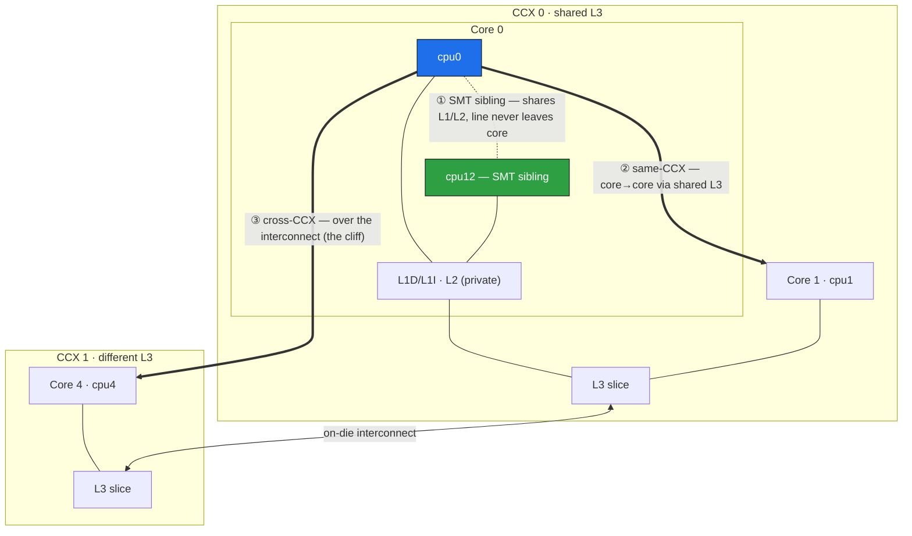
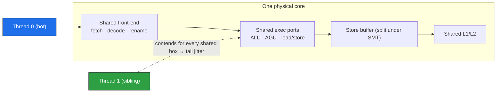
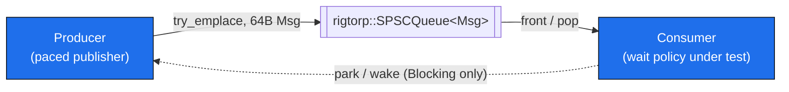

# smt_pingpong (SMT-IPC)

Three small x86-64 Linux microbenchmarks probing inter-thread handoff latency and the wait-strategy / core-placement tradeoffs that matter for latency-critical pipelines:

- **`smt_pingpong`** — round-trip latency of bouncing one cache line between two CPUs, across three topology distances (SMT sibling, same-L3/CCX, cross-CCX).
- **`sibling_noise`** — does a *busy* SMT sibling slow down a port-bound thread sharing its core? (Yes, ~1.8× in the median.)
- **`spsc_pipeline`** — a producer→queue→consumer pipeline measuring the latency-vs-core-utilization crossover between spinning and kernel-blocking wait strategies, under both steady and bursty arrival.

All three share `pp_core.hpp` (TSC calibration, pinning, percentiles, sysfs topology discovery). **x86-64 Linux only** (`rdtsc`, `_mm_pause`, sysfs).

## Build & run

```sh
cmake -B build && cmake --build build && ctest --test-dir build   # builds all 3 + runs self-tests
# or directly:
g++ -O3 -std=c++23 -pthread smt_pingpong.cpp  -o smt_pingpong
g++ -O3 -std=c++23 -pthread sibling_noise.cpp -o sibling_noise
g++ -O3 -std=c++23 -pthread spsc_pipeline.cpp -o spsc_pipeline    # (needs rigtorp/SPSCQueue include; use CMake)
```

```sh
./smt_pingpong           # auto: one pair per topology tier
./smt_pingpong 0 12      # explicit CPU pair (validated; fatal on bad args / pin failure)
./sibling_noise          # auto: cpu_hot + its SMT sibling
./spsc_pipeline          # steady arrival-rate sweep
./spsc_pipeline --bursty # bursty (on/off) arrival sweep
<tool> --test            # pure-logic self-checks, no timing hardware needed
```

Bad CPU args and pin failures are always fatal (non-zero exit) rather than producing a meaningless run. A missing SMT sibling is fatal only where the tool requires one (`sibling_noise`); `smt_pingpong` auto mode just prints `(no such pair)` and skips that tier.

---

## `smt_pingpong` — cache-line handoff latency

Two pinned threads bounce a monotonically increasing sequence number through two flags, each on its own 128B-aligned region (rules out false sharing and adjacent-line prefetch). The strictly-increasing value rules out ABA: the spin exits only on *this* iteration's value.

```
INITIATOR (timed)                RESPONDER
t0 = rdtsc
store a = i   --line a-->         spin until a == i
                                  store b = i
spin until b == i  <--line b--
t1 = rdtsc ; sample = t1 - t0     (one round trip)
```

Each store forces the other core to give up the line (coherence invalidate / RFO), so exactly one line moves each way. Both threads hot-spin throughout — this is the **best-case handoff between two live spinners**, no wakeup cost. Timing is `lfence; rdtsc; lfence` (~20–30 ns observer tax, in every number), converted to ns via a TSC frequency calibrated against `steady_clock`. Each pair: 200k warm-up + 2M recorded round trips.

**Topology tiers** (auto mode, discovered from sysfs, anchored on cpu0). On Zen, L1/L2 are private per core, so "shares L2" == "is an SMT sibling" — there is no separate same-L2 tier.



**Two spin variants**, run on the cross-core tiers: **pause** (`_mm_pause`, polite but its ~64-cycle park on Zen 2+ *adds* detection latency) and **bare-spin** (tight re-load, closer to raw coherence latency but hammers the load unit). The SMT-sibling pair runs **pause only** — a bare spin on one sibling starves the shared execution ports the other needs, measuring self-inflicted starvation rather than handoff. That sharing is also why a *busy* sibling hurts the tail:



### Results

AMD Zen box, 12c/24t, TSC ~1.996 GHz, **SMT on but no core isolation, boost/governor not locked** — treat absolutes as noisy; the *ordering* is the robust result, and compare rows only within one run.

| Pair (variant) | min | p50 | p99 | p99.9 |
|---|---:|---:|---:|---:|
| SMT sibling (pause) | ~30 | ~50 | ~70 | ~70 |
| same L3/CCX (pause) | ~60 | ~90 | ~120 | ~140 |
| cross CCX (pause) | ~200 | ~711 | ~922 | ~2294 |
| cross CCX (bare-spin) | ~240 | ~741 | ~912 | ~2174 |

- **The topology ordering holds at every percentile**: sibling < same-CCX < cross-CCX. The CCX crossing is the big cliff (~8× the same-CCX median).
- **pause vs bare-spin is roughly a wash on this box**: at both cross-core tiers the two variants sit within a few percent of each other — PAUSE's added detection latency and bare-spin's load-unit pressure / exit mispredict roughly cancel. (The gap is power-state dependent; under a locked governor pause can phase-lock to a larger multiple. Only compare the two within one run.)
- **The microsecond p99.99/max outliers are OS jitter**, not hardware — affinity steers only this benchmark's threads.

> The flag writes are `std::atomic` acquire/release not for hardware atomicity (an aligned 8B store never tears on x86) but for the C++ data-race rule — a plain load in the spin gets hoisted into an infinite loop at `-O2`. On x86 they compile to plain `mov` (no `lock`/`mfence`), so correctness costs nothing here.

---

## `sibling_noise` — does a busy sibling slow a port-bound victim?

`smt_pingpong`'s sibling row uses the sibling as the *cooperative* ping-pong responder, so it never measures a genuinely noisy tenant. This experiment isolates that variable: 100% of the timed **victim** work runs on `cpu_hot` — a throughput-bound, high-ILP block (8 independent accumulator lanes over a 4KB L1-resident buffer) that saturates the core's integer-multiply pipes. A **tenant** on the SMT sibling runs one of three states per pass: **idle** (no thread), **noop** (`_mm_pause`, yields ports), **hot** (the same 8-lane shape, genuinely contending for ports). Passes are interleaved across 8 repeats to spread thermal/scheduler drift; per-repeat median spread is the significance check. (A dependent/latency-bound victim — pointer chase, single accumulator — is what SMT coexists with well, so it must be port-bound to be sensitive.)

**Result** (same box; `hot=cpu0`, `sibling=cpu12`; 40k samples/state over 8 repeats):

| Tenant | median (ns/chunk) | vs idle |
|---|---:|---:|
| idle | 370.7 | — |
| noop (pause) | 380.7 | +3% |
| hot (busy) | 671.2 | **1.81×** |

A busy sibling nearly doubles the work in the median; a polite pausing sibling is indistinguishable from none. Per-repeat median spread is ~10 ns against a ~300 ns between-state gap, so the ordering is real, not noise — tails stay OS-jitter-sensitive without core isolation. Note "idle" means *no tenant thread spawned*, not a quiesced core (that needs root `isolcpus`/offlining) — the kernel can still land other work there.

---

## `spsc_pipeline` — spin vs block: the latency/utilization crossover

The first two tools keep every CPU fully busy. Real pipelines aren't: when messages arrive slowly, spinning to catch the next one burns a whole core (or half a physical core, on a sibling) for nothing. This asks: *at what arrival rate does spinning stop being worth it, and what latency do you pay to let the consumer sleep?*



One producer, one consumer, one [`rigtorp::SPSCQueue<Msg>`](https://github.com/rigtorp/SPSCQueue) (FetchContent, pinned to a commit). Each `Msg` is one 64B line. Consumer anchored on cpu0; producer on a partner selected by tier. Latency is end-to-end: `t_done − pub_tsc`, `pub_tsc` stamped once at the first `try_emplace` (a backpressure retry never re-stamps).

**Three consumer wait policies** (a compile-time template parameter, not a per-iteration branch):

| Policy | On empty queue | Trade |
|---|---|---|
| BareSpin | tight `front()` re-poll | zero detection latency, burns 100% of a core |
| Pause | re-poll with `_mm_pause` | ~same, but yields shared ports to an SMT sibling |
| Blocking | parks on a futex, producer wakes it conditionally | frees the core between messages, at a µs-scale wake tax |

BareSpin is skipped on the sibling tier (same port-starvation reason as `smt_pingpong`); Blocking is the marquee sibling row (a parked consumer frees the *whole* logical CPU). Blocking uses a hand-rolled futex eventcount (not `condition_variable`, to measure raw kernel cost); the producer only issues `FUTEX_WAKE` when the consumer is actually parked, so it degrades to ~free at saturation. Correctness against the missed-wake race rests on a **seq_cst Dekker fence pair** (one `atomic_thread_fence(seq_cst)` on each side, between its store and its load) — argued in the code, since the race window is a few ns and not reliably reproducible from userspace. Producer pacing uses an absolute-deadline schedule (a late message never drags the rest).

### The crossover

The steady sweep runs `gap ∈ {0, 250, 1000, 5000, 20000} ns`. At `gap=0` all three policies converge (the queue is never idle; that row's latency is queue-depth sojourn, not wake cost). As the gap widens, **spin/pause keep burning a full core for a shrinking trickle of messages, while Blocking's consumer goes idle (parked-fraction → ~0.8+) at a µs-scale wake per message.** Where the crossover sits is workload- and machine-dependent — read the `parked-fraction` and latency columns together. Per-cell instrumentation (`waited-fraction`, `futex-wake-syscalls`, `futex-backstop-fires` — which must be 0; nonzero is a missed-wake smoking gun) makes the regime observable.

### Bursty arrival (`--bursty`)

Real feeds are bursty — quiet stretches, then back-to-back messages — and that's the regime where Blocking should shine: only the *first* message of a burst pays a wake; the rest are drained while the consumer is already awake. `--bursty` runs an on/off schedule: `BURST_LEN ∈ {1,4,16,64}` messages back-to-back, then a 20µs idle gap. (`BURST_LEN=1` reduces to the even sweep — a built-in cross-check.) Each latency sample is tagged **cold** (the consumer paid its wait path — a syscall, for Blocking) or **warm** (the message was already there).

**Result** (SMT-sibling tier, one run; compare within run):

| BURST_LEN | Blocking wakes/burst | Blocking p50 | Pause p50 | ratio |
|---:|---:|---:|---:|---:|
| 1 (= gap=20000) | — | 1322 | 150 | 8.8× |
| 4 | 0.99 | 1352 | 321 | 4.2× |
| 16 | 1.00 | 2114 | 842 | 2.5× |
| 64 | 0.99 | 5290 | 3086 | 1.7× |

- **Amortization is essentially perfect**: Blocking pays ≈1.0 wakes per burst regardless of burst length (vs the naive `BURST_LEN`), and its latency closes on Pause's as bursts grow (8.8× → 1.7×). Bursts are exactly where blocking becomes competitive.
- **Warm-message p50 is queue sojourn, not wake cost**: with back-to-back publication a mid-burst message sits behind its burst-mates, so its end-to-end latency is ≈ position × drain time (~100 ns/slot; the warm bucket is ~100% mid-burst). It rises with burst length and does not shrink on an isolated box — it's queueing, not jitter. Genuine wake avoidance shows only for Blocking at short even-sweep gaps, where warm p50 lands below cold.

---

## Why this matters for HFT (and why firms disable SMT)

- **SMT siblings give the fastest raw handoff** (line stays in shared L1/L2). If two hot stages hand off constantly, sibling placement wins on raw latency.
- **But a busy sibling wrecks it** — ~1.8× slowdown from a port-hungry tenant (`sibling_noise`). The fast median holds only while the sibling stays cooperative or empty.
- **Affinity is necessary but not sufficient**: pinning steers *your* thread, not the kernel/IRQs/other processes the scheduler puts on the sibling. To truly empty a sibling you need boot-time isolation (`isolcpus`+`nohz_full`+`irqaffinity`) or offlining (`echo 0 > .../cpuN/online`) covering *both* logical CPUs of the core.
- **The hybrid real shops use**: isolate + offline the sibling on hot-path cores, keep SMT elsewhere for throughput. Global BIOS SMT-off closes the last sliver (some structures are statically partitioned even with an idle sibling).
- The cross-CCX cliff is the same lesson one level up: keep tightly-coupled threads within one CCX; treat any CCX/socket crossing as a budgeted cost.

## Caveats

- **No core isolation on this box**: absolutes (especially p99.9+ tails) are environment-sensitive — compare rows *within one run*. `late-publish` / `waited-fraction` are the more robust cross-run signals (derived from the pacing schedule, not raw tail latency).
- **TSC**: calibrated against `steady_clock`, assumes invariant TSC (`constant_tsc nonstop_tsc`).
- **Not measured**: throughput/bandwidth, tail latency under third-party contention, and (for `smt_pingpong`) thread-wakeup cost — it's the floor for two already-spinning threads.
- **`mwaitx` is not used**: on this Zen 5 box the AMD hardware wait-on-address woke at ~260 ns p50 vs ~60 ns for a plain spin (>4× slower, ~350–480 ns timeout floor) — not viable for a sub-µs handoff, so Blocking uses a futex.

## Future work

- **Spin-then-park hybrid** for Blocking (spin briefly before parking) — likely a better trade at the low end than park-on-first-empty.
- **Poisson inter-arrival** — a more realistic mix of gaps than the deterministic schedules.
- **Wake-only timestamp** — isolate the park→wake→re-check span from processing/queueing to separate genuine wake cost from sojourn time.
